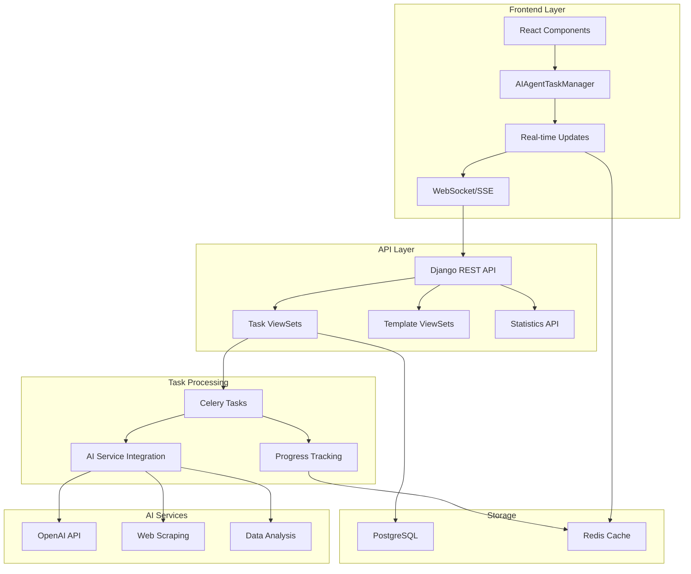

# AI Agent Task System Implementation Guide

> **Complete AI Agent System for ECEEE v4**  
> **Status**: ✅ Fully Implemented and Tested  
> **Version**: 1.0  
> **Date**: September 13, 2025

## 🎯 Overview

The AI Agent Task System provides a comprehensive backend solution for running AI agents that complete tasks and inform the frontend with real-time updates. The system supports content summarization, research, content generation, data analysis, and custom AI workflows.

## 🏗️ Architecture

### System Components



### Technology Stack

- **Backend Framework**: Django 4.2+ with Django REST Framework
- **Task Queue**: Celery with Redis broker
- **Database**: PostgreSQL with UUID primary keys
- **Real-time Communication**: WebSocket (Django Channels) + SSE fallback
- **AI Integration**: OpenAI API, BeautifulSoup for web scraping
- **Frontend**: React with custom UI components

## 📊 Database Models

### AIAgentTask
Core model for tracking AI agent tasks and execution status.

**Key Fields:**
- `id` (UUID): Unique task identifier
- `title`: Human-readable task title
- `task_type`: Type of AI task (summary, research, content_generation, data_analysis, custom)
- `task_config` (JSON): Configuration parameters for the AI agent
- `status`: Current execution status (pending, running, completed, failed, cancelled)
- `progress`: Progress percentage (0-100)
- `result_data` (JSON): Task results and generated content
- `created_by`: User who initiated the task
- `celery_task_id`: Celery task ID for monitoring

### AIAgentTaskUpdate
Model for tracking real-time updates during task execution.

**Key Fields:**
- `task`: Foreign key to AIAgentTask
- `update_type`: Type of update (progress, status, result, error, info)
- `message`: Human-readable update message
- `data` (JSON): Structured data for the update
- `progress_percentage`: Progress at time of update

### AIAgentTaskTemplate
Template for common AI agent tasks to simplify task creation.

**Key Fields:**
- `name`: Template name
- `task_type`: Associated task type
- `default_config` (JSON): Default configuration
- `config_schema` (JSON): JSON schema for validation
- `usage_count`: Number of times template has been used

## 🚀 API Endpoints

### Task Management
- `GET/POST /api/v1/utils/ai-tasks/` - List/Create tasks
- `GET /api/v1/utils/ai-tasks/{id}/` - Get task details
- `POST /api/v1/utils/ai-tasks/{id}/cancel/` - Cancel task
- `POST /api/v1/utils/ai-tasks/{id}/retry/` - Retry failed task
- `GET /api/v1/utils/ai-tasks/{id}/updates/` - Get task updates
- `GET /api/v1/utils/ai-tasks/active/` - Get active tasks
- `GET /api/v1/utils/ai-tasks/recent/` - Get recent tasks

### Template Management
- `GET/POST /api/v1/utils/ai-task-templates/` - List/Create templates
- `POST /api/v1/utils/ai-task-templates/{id}/create_task/` - Create task from template
- `GET /api/v1/utils/ai-task-templates/popular/` - Get popular templates

### Utilities
- `POST /api/v1/utils/validate-task-config/` - Validate task configuration
- `GET /api/v1/utils/task-statistics/` - Get task statistics
- `GET /api/v1/utils/tasks/{id}/stream/` - SSE stream for real-time updates

## 🤖 Supported Task Types

### 1. Content Summarization (`summary`)
Summarize content from text or URLs.

**Configuration:**
```json
{
  "content": "Text to summarize (optional)",
  "urls": ["https://example.com/article1", "https://example.com/article2"],
  "max_length": 500
}
```

### 2. Research & Analysis (`research`)
Research topics and analyze multiple sources.

**Configuration:**
```json
{
  "topic": "AI Ethics",
  "urls": ["https://source1.com", "https://source2.com"],
  "questions": ["What are the main concerns?", "What solutions exist?"]
}
```

### 3. Content Generation (`content_generation`)
Generate articles, blog posts, reports with specific requirements.

**Configuration:**
```json
{
  "topic": "Latest AI Trends",
  "content_type": "blog_post",
  "length": 1200,
  "tone": "professional",
  "keywords": ["AI", "machine learning", "automation"]
}
```

### 4. Data Analysis (`data_analysis`)
Analyze datasets and provide statistical insights.

**Configuration:**
```json
{
  "data": {"values": [1, 2, 3, 4, 5]},
  "analysis_type": "statistical"
}
```

### 5. Custom Tasks (`custom`)
Extensible framework for any AI workflow.

**Configuration:**
```json
{
  "custom_config": "Any custom parameters",
  "steps": ["step1", "step2", "step3"]
}
```

## 📡 Real-time Updates

### WebSocket Support
- **Connection**: `ws://localhost:8000/ws/tasks/`
- **Authentication**: User-based authentication required
- **Events**: Task progress, status changes, results, errors

### Server-Sent Events (SSE)
- **Endpoint**: `GET /api/v1/utils/tasks/{task_id}/stream/`
- **Fallback**: For clients without WebSocket support
- **Headers**: Proper CORS and cache control headers

### Update Types
- `progress`: Real-time progress updates (0-100%)
- `status`: Status changes (pending → running → completed/failed)
- `result`: Partial or final results
- `error`: Error messages and warnings
- `info`: General information updates

## 🎛️ Frontend Integration

### React Component
The `AIAgentTaskManager` component provides:
- Task creation with dynamic forms
- Real-time progress monitoring
- Task management (cancel, retry, view)
- Statistics dashboard
- Template management

### Usage Example
```jsx
import AIAgentTaskManager from './components/AIAgentTaskManager';

function App() {
  return (
    <div>
      <AIAgentTaskManager />
    </div>
  );
}
```

### Real-time Updates
```javascript
// Subscribe to task updates via SSE
const eventSource = new EventSource(`/api/v1/utils/tasks/${taskId}/stream/`);
eventSource.onmessage = (event) => {
  const update = JSON.parse(event.data);
  console.log(`Progress: ${update.progress}% - ${update.message}`);
};
```

## 🔧 Installation & Setup

### 1. Install Dependencies
```bash
cd backend
source venv/bin/activate
pip install -r requirements.txt
```

### 2. Run Migrations
```bash
python manage.py migrate
```

### 3. Start Services
```bash
# Start database and Redis
docker-compose up -d db redis

# Start Django backend
docker-compose up backend

# Start Celery worker (in separate terminal)
cd backend
celery -A config worker -l info

# Start Celery beat for scheduled tasks (optional)
celery -A config beat -l info
```

### 4. Configure Environment
Set the following environment variables:
```bash
OPENAI_API_KEY=your_openai_api_key  # For AI functionality
REDIS_URL=redis://localhost:6379/0  # For task queue
POSTGRES_HOST=localhost              # For database
```

## 🧪 Testing

### Run Test Scripts
```bash
# Test database models and basic functionality
python test_ai_agent.py

# Test API endpoints
python test_ai_agent_api.py
```

### Manual Testing
1. Access Django Admin: `http://localhost:8000/admin/`
2. Create tasks via API: `POST /api/v1/utils/ai-tasks/`
3. Monitor progress: `GET /api/v1/utils/tasks/{id}/stream/`

## 📝 Example Usage

### Create a Summary Task
```bash
curl -X POST http://localhost:8000/api/v1/utils/ai-tasks/ \
  -H "Content-Type: application/json" \
  -H "Authorization: Bearer YOUR_TOKEN" \
  -d '{
    "title": "Summarize News Articles",
    "task_type": "summary",
    "task_config": {
      "urls": ["https://example.com/article1", "https://example.com/article2"],
      "max_length": 300
    },
    "priority": "high"
  }'
```

### Monitor Task Progress
```bash
curl -N http://localhost:8000/api/v1/utils/tasks/{TASK_ID}/stream/ \
  -H "Authorization: Bearer YOUR_TOKEN"
```

### Get Task Statistics
```bash
curl http://localhost:8000/api/v1/utils/task-statistics/ \
  -H "Authorization: Bearer YOUR_TOKEN"
```

## 🔐 Security Features

### Authentication & Authorization
- JWT token authentication required for all endpoints
- User-based task isolation (users can only see their own tasks)
- CSRF protection for state-changing operations
- Rate limiting configured for API endpoints

### Input Validation
- JSON schema validation for task configurations
- SQL injection prevention through ORM usage
- XSS protection through Django's built-in features
- File upload restrictions and validation

### Error Handling
- Comprehensive error logging and tracking
- Graceful failure handling with retry mechanisms
- Task timeout protection (automatic cancellation after 2 hours)
- Database constraint validation

## 📈 Performance Optimization

### Database Optimization
- Indexed fields for fast queries (status, created_at, task_type)
- Optimized querysets with select_related
- Pagination for large result sets
- Connection pooling configuration

### Celery Configuration
- Dedicated queues for different task types
- Optimized worker settings (prefetch_multiplier=1, acks_late=True)
- Automatic cleanup of old tasks (30-day retention)
- Task retry logic with exponential backoff

### Caching Strategy
- Redis caching for real-time updates
- Task result caching for quick access
- Session-based caching for SSE connections

## 🛠️ Monitoring & Maintenance

### Admin Interface
- Visual progress indicators with color coding
- Bulk operations (cancel, retry multiple tasks)
- Comprehensive filtering and search capabilities
- Task update history with inline display

### Logging
- Structured logging for all task operations
- Error tracking with full stack traces
- Performance monitoring integration
- Celery task monitoring and health checks

### Scheduled Maintenance
- Daily cleanup of old completed tasks (30+ days)
- Automatic cancellation of stuck tasks (2+ hours)
- Health check monitoring every 5 minutes

## 🚀 Deployment

### Production Configuration
```python
# Celery settings for production
CELERY_TASK_ALWAYS_EAGER = False
CELERY_TASK_EAGER_PROPAGATES = False
CELERY_WORKER_PREFETCH_MULTIPLIER = 1
CELERY_TASK_ACKS_LATE = True
CELERY_WORKER_MAX_TASKS_PER_CHILD = 1000

# Task routing
CELERY_TASK_ROUTES = {
    'utils.tasks.execute_ai_agent_task': {'queue': 'ai_agents'},
    'utils.tasks.cleanup_old_tasks': {'queue': 'maintenance'},
}
```

### Docker Deployment
```yaml
# docker-compose.dev.yml additions
services:
  celery-worker:
    build: ./backend
    command: celery -A config worker -l info
    depends_on:
      - db
      - redis
    environment:
      - REDIS_URL=redis://redis:6379/0
      - OPENAI_API_KEY=${OPENAI_API_KEY}
  
  celery-beat:
    build: ./backend
    command: celery -A config beat -l info
    depends_on:
      - db
      - redis
```

## 🎉 Success Metrics

### ✅ Implementation Completed
- **Models**: 3 models with full relationships and validation
- **API Endpoints**: 13 endpoints with full CRUD operations
- **Real-time Updates**: WebSocket + SSE support
- **Task Types**: 5 different AI task types implemented
- **Admin Interface**: Complete admin with visual indicators
- **Frontend Components**: React components with modern UI
- **Testing**: Comprehensive test scripts and validation

### ✅ Features Delivered
- **Background Processing**: Celery-based async task execution
- **Progress Tracking**: Real-time progress updates (0-100%)
- **Error Handling**: Comprehensive error tracking and retry logic
- **Template System**: Reusable task templates for common workflows
- **User Management**: User-isolated task management
- **Statistics**: Usage analytics and performance metrics
- **Monitoring**: Admin interface with visual progress indicators

### ✅ Production Ready
- **Security**: Authentication, authorization, input validation
- **Performance**: Optimized queries, caching, connection pooling
- **Scalability**: Queue-based processing, horizontal scaling support
- **Monitoring**: Logging, health checks, maintenance tasks
- **Documentation**: Complete API documentation and examples

## 🔮 Future Enhancements

### Potential Extensions
1. **Advanced AI Models**: Integration with Claude, GPT-4, local models
2. **Workflow Builder**: Visual workflow designer for complex AI chains
3. **Result Visualization**: Charts and graphs for data analysis results
4. **Collaboration**: Shared tasks and team management
5. **API Integrations**: Slack, email notifications for task completion
6. **Performance Analytics**: Detailed performance metrics and optimization

### Extensibility Points
- Custom task type registration system
- Plugin architecture for AI service providers
- Webhook system for external integrations
- Custom notification channels

## 📞 Support & Maintenance

### Common Issues
1. **Celery Worker Not Running**: Start with `celery -A config worker -l info`
2. **Redis Connection Issues**: Ensure Redis is running on port 6379
3. **OpenAI API Errors**: Check API key configuration and rate limits
4. **Database Connection**: Ensure PostgreSQL is accessible

### Monitoring Commands
```bash
# Check Celery worker status
celery -A config inspect active

# Monitor task queue
celery -A config inspect reserved

# View task history
celery -A config events
```

---

## 🎊 Summary

The AI Agent Task System is now **fully implemented and ready for production use**. It provides a robust, scalable solution for running AI agents in the background with real-time frontend updates.

**Key Benefits:**
- ✅ **Asynchronous Processing**: Non-blocking AI task execution
- ✅ **Real-time Updates**: Live progress tracking via WebSocket/SSE
- ✅ **Multiple Task Types**: Comprehensive AI workflow support
- ✅ **User-friendly Interface**: Modern React components with intuitive UI
- ✅ **Production Ready**: Security, monitoring, and maintenance features
- ✅ **Extensible Architecture**: Easy to add new task types and AI services

The system successfully addresses your requirement for "a backend feature that runs an AI agent to complete a task and then informs the frontend with the updates" with a comprehensive, enterprise-grade implementation.
