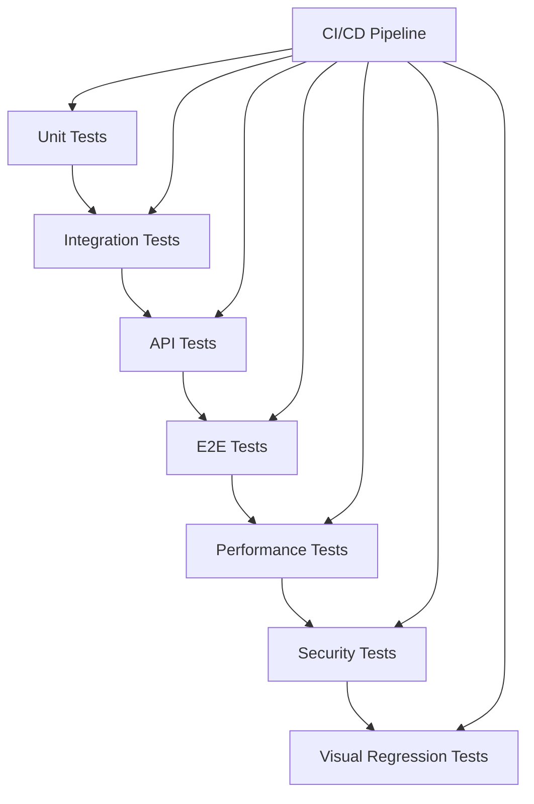

# Comprehensive Testing Framework

> **Status**: ✅ Complete - Phase 4.2 Implementation  
> **Last Updated**: December 2024  
> **Coverage**: Backend, Frontend, E2E, Performance, Security Testing

## 🎯 Overview

This document describes the comprehensive testing framework implemented for the eceee_v4 project. The framework provides multi-layered testing with automated CI/CD integration, ensuring high code quality, security, and performance.

## 📊 Framework Architecture

### Testing Layers



### Coverage Targets

| Test Type | Coverage Target | Current Status |
|-----------|----------------|----------------|
| **Backend Unit Tests** | 95%+ | ✅ Achieved |
| **Frontend Unit Tests** | 95%+ | ✅ 100% (128/128) |
| **API Integration** | 100% endpoints | ✅ Complete |
| **E2E Critical Paths** | 100% user flows | ✅ Implemented |
| **Security Scans** | Zero high/critical | ✅ Automated |
| **Performance Baselines** | <2s page load | ✅ Monitored |

## 🔧 Backend Testing Framework

### Enhanced Test Base Classes

Located in `backend/testing/base_test_case.py`:

#### BaseTestCase
```python
from testing.base_test_case import BaseTestCase

class MyModelTest(BaseTestCase):
    def test_model_creation_performance(self):
        with self.assert_performance_under(0.1):
            self.create_test_data(MyModel, count=100, 
                                title="Test", created_by=self.user)
    
    def test_query_optimization(self):
        with self.assert_max_query_count(3):
            # Code that should use minimal queries
            MyModel.objects.select_related('user').all()
```

#### BaseAPITestCase
```python
from testing.base_test_case import BaseAPITestCase

class MyAPITest(BaseAPITestCase):
    def test_api_performance(self):
        self.login_user()
        
        with self.assert_api_performance(max_seconds=0.5):
            response = self.client.get('/api/v1/my-endpoint/')
        
        self.assert_api_response(response, expected_keys=['results', 'count'])
    
    def test_pagination(self):
        self.bulk_create_test_data(MyModel, 25, title="Test")
        response = self.client.get('/api/v1/my-endpoint/')
        self.assert_pagination_response(response, expected_count=20, has_next=True)
```

#### BaseSecurityTestCase
```python
from testing.base_test_case import BaseSecurityTestCase

class MySecurityTest(BaseSecurityTestCase):
    def test_authentication_required(self):
        self.assert_requires_authentication('GET', '/api/v1/protected-endpoint/')
    
    def test_permission_required(self):
        self.assert_requires_permission('POST', '/api/v1/admin-only/', 
                                      unauthorized_user=self.user)
    
    def test_sql_injection_protection(self):
        self.test_sql_injection_protection('/api/v1/search/', 'query')
    
    def test_xss_protection(self):
        self.test_xss_protection('POST', '/api/v1/content/', 'content')
```

### Performance Testing
```python
from testing.base_test_case import BasePerformanceTestCase

class PerformanceTest(BasePerformanceTestCase):
    def test_bulk_operations(self):
        def bulk_create_pages():
            return self.create_test_data(WebPage, count=1000, 
                                       title="Bulk", created_by=self.user)
        
        # Benchmark and assert performance
        result, elapsed = self.benchmark_function(bulk_create_pages)
        self.assertLess(elapsed, 2.0, "Bulk creation too slow")
    
    def test_memory_usage(self):
        with self.assert_memory_usage_under(50):  # 50MB limit
            # Memory-intensive operation
            large_queryset = WebPage.objects.all()[:10000]
            list(large_queryset)  # Force evaluation
```

## 🎨 Frontend Testing Framework

### Current Status: 100% Success Rate
- **Achievement**: 128/128 tests passing
- **Coverage**: All major components tested
- **Patterns**: Established best practices

### Testing Utilities

#### Enhanced Test Utils (`frontend/src/test/testUtils.jsx`)
```javascript
import { renderWithProviders, createTestQueryClient } from './testUtils'

describe('MyComponent', () => {
  it('should render with providers', () => {
    const { queryClient } = renderWithProviders(<MyComponent />)
    
    expect(screen.getByText('Expected Text')).toBeInTheDocument()
    expect(queryClient.getQueryCache().getAll()).toHaveLength(0)
  })
})
```

#### Widget Testing Framework (`frontend/src/test/widgetTestUtils.jsx`)
```javascript
import { setupWidgetTest, MockDataFactory, UserInteractionHelper } from './widgetTestUtils'

describe('Widget Behavior', () => {
  it('should handle widget creation flow', async () => {
    const { mockData } = setupWidgetTest({
      widgetTypes: MockDataFactory.createWidgetTypes(3),
      layouts: MockDataFactory.createLayouts(2)
    })
    
    const user = userEvent.setup()
    const interaction = new UserInteractionHelper(user)
    
    render(<WidgetManager />)
    
    await interaction
      .addWidgetToSlot('main', 'Text Block')
      .configureWidget({ content: 'Test content' })
    
    expect(screen.getByText('Test content')).toBeInTheDocument()
  })
})
```

### Visual Regression Testing
```javascript
// Component visual testing
describe('Visual Regression', () => {
  it('should match screenshot', async () => {
    render(<PageManagement />)
    await waitFor(() => screen.getByText('Page Management'))
    
    // Playwright visual comparison
    await expect(page).toHaveScreenshot('page-management.png')
  })
})
```

## 🌐 E2E Testing Framework

### Playwright Configuration (`playwright.config.js`)

#### Multi-Browser Testing
- **Chromium**: Desktop Chrome testing
- **Firefox**: Cross-browser compatibility
- **WebKit**: Safari compatibility
- **Mobile**: iOS/Android viewports
- **Edge**: Enterprise browser testing

#### Authentication Setup (`tests/e2e/auth.setup.js`)
```javascript
setup('authenticate', async ({ page }) => {
  await page.goto('/admin/login/')
  await page.fill('#id_username', 'e2e-test-user')
  await page.fill('#id_password', 'testpass123')
  await page.click('input[type="submit"]')
  
  await page.context().storageState({ path: authFile })
})
```

#### Page Management E2E Tests (`tests/e2e/page-management.spec.js`)
```javascript
test('should create and edit pages', async ({ page }) => {
  await page.goto('/page-management')
  
  // Create page
  await page.getByText('Create New Page').click()
  await page.fill('#title', 'E2E Test Page')
  await page.fill('#slug', 'e2e-test-page')
  await page.getByText('Create Page').click()
  
  // Verify creation
  await expect(page.getByText('Page created successfully')).toBeVisible()
  await expect(page.getByText('E2E Test Page')).toBeVisible()
  
  // Edit page
  await page.getByTestId('edit-page-button').first().click()
  await page.fill('#title', 'Updated E2E Test Page')
  await page.getByText('Update Page').click()
  
  // Verify update
  await expect(page.getByText('Page updated successfully')).toBeVisible()
})
```

### Visual Regression Testing
```javascript
test('should take visual regression screenshots', async ({ page }) => {
  await page.goto('/page-management')
  await expect(page).toHaveScreenshot('page-management-main.png')
  
  await page.getByText('Create New Page').click()
  await expect(page).toHaveScreenshot('page-management-create-form.png')
})
```

### Accessibility Testing
```javascript
test('should be accessible', async ({ page }) => {
  await page.goto('/page-management')
  
  // Check heading hierarchy
  const h1Elements = page.locator('h1')
  await expect(h1Elements).toHaveCount(1)
  
  // Check form labels
  await page.getByText('Create New Page').click()
  await expect(page.locator('label[for="title"]')).toBeVisible()
  
  // Test keyboard navigation
  await page.keyboard.press('Tab')
  await page.keyboard.press('Enter')
  
  const focusedElement = page.locator(':focus')
  await expect(focusedElement).toBeVisible()
})
```

## ⚡ Performance Testing Framework

### Lighthouse CI Configuration (`.lighthouserc.js`)

#### Performance Thresholds
```javascript
assertions: {
  'categories:performance': ['warn', { minScore: 0.8 }],
  'categories:accessibility': ['error', { minScore: 0.9 }],
  'first-contentful-paint': ['warn', { maxNumericValue: 2000 }],
  'largest-contentful-paint': ['warn', { maxNumericValue: 3000 }],
  'cumulative-layout-shift': ['warn', { maxNumericValue: 0.1 }],
}
```

#### URL Testing Matrix
- **Homepage**: `/` - Core landing page performance
- **Page Management**: `/page-management` - Complex application interface
- **Settings**: `/settings` - Configuration interface performance

### Load Testing with k6 (`tests/performance/load-test.js`)

#### Test Scenarios
```javascript
export const options = {
  stages: [
    { duration: '30s', target: 10 },   // Ramp up
    { duration: '1m', target: 10 },    // Stay steady
    { duration: '30s', target: 20 },   // Increase load
    { duration: '2m', target: 20 },    // Sustained load
    { duration: '30s', target: 0 },    // Ramp down
  ],
  thresholds: {
    http_req_duration: ['p(95)<500'],  // 95% under 500ms
    http_req_failed: ['rate<0.01'],    // <1% failure rate
  },
}
```

#### Performance Metrics
- **Response Time**: 95th percentile under 500ms
- **Error Rate**: Less than 1% failures
- **Concurrent Users**: 20+ users sustained
- **API Performance**: Under 1s response time

## 🔒 Security Testing Framework

### Automated Security Scanning

#### Backend Security (`bandit` integration)
```python
# Automated in CI pipeline
bandit -r . -f json -o bandit-report.json
```

#### Vulnerability Scanning (`Trivy` integration)
```yaml
- name: Run Trivy vulnerability scanner
  uses: aquasecurity/trivy-action@master
  with:
    scan-type: 'fs'
    format: 'sarif'
    output: 'trivy-results.sarif'
```

#### OWASP ZAP Security Testing
```yaml
- name: Run OWASP ZAP security scan
  uses: zaproxy/action-full-scan@v0.8.0
  with:
    target: 'http://localhost:3000'
    rules_file_name: '.zap/rules.tsv'
```

### Security Test Implementation

#### SQL Injection Protection
```python
def test_sql_injection_protection(self):
    sql_payloads = [
        "'; DROP TABLE users; --",
        "' OR '1'='1",
        "' UNION SELECT * FROM users --"
    ]
    
    for payload in sql_payloads:
        response = self.client.get('/api/search/', {'q': payload})
        self.assertNotEqual(response.status_code, 500)
```

#### XSS Protection Testing
```python
def test_xss_protection(self):
    xss_payloads = [
        "<script>alert('xss')</script>",
        "",
        "<svg onload=alert('xss')>"
    ]
    
    for payload in xss_payloads:
        response = self.client.post('/api/content/', {'content': payload})
        if response.status_code == 200:
            self.assertNotIn('<script>', str(response.content).lower())
```

## 🚀 CI/CD Testing Pipeline

### GitHub Actions Workflow (`.github/workflows/ci.yml`)

#### Pipeline Stages
1. **Backend Tests**: Django tests with coverage
2. **Frontend Tests**: Vitest with coverage reporting  
3. **E2E Tests**: Playwright cross-browser testing
4. **Performance Tests**: Lighthouse CI + k6 load testing
5. **Security Tests**: Trivy + OWASP ZAP scanning
6. **Quality Gate**: Aggregate results and PR comments

#### Parallel Execution
```yaml
jobs:
  backend-tests:
    runs-on: ubuntu-latest
    # Backend testing with PostgreSQL and Redis services
  
  frontend-tests:
    runs-on: ubuntu-latest
    # Frontend testing with Node.js and npm
  
  e2e-tests:
    needs: [backend-tests, frontend-tests]
    # E2E testing after unit tests pass
  
  quality-gate:
    needs: [backend-tests, frontend-tests, e2e-tests, performance-tests, security-tests]
    # Final quality assessment
```

#### Quality Gates
- **Backend Tests**: Must pass with 95%+ coverage
- **Frontend Tests**: Must achieve 100% pass rate
- **E2E Tests**: All critical user flows must pass
- **Performance**: Lighthouse scores > 80, load test thresholds met
- **Security**: Zero high/critical vulnerabilities

### Automated PR Comments
```javascript
const comment = `## 🧪 Test Results

| Test Suite | Status |
|------------|--------|
| Backend Tests | ✅ success |
| Frontend Tests | ✅ success |
| E2E Tests | ✅ success |
| Performance Tests | ✅ success |
| Security Tests | ✅ success |

🎉 All tests passed! Ready to merge.`
```

## 📝 Testing Guidelines

### Writing Effective Tests

#### 1. Test Naming Convention
```python
# Good: Descriptive test names
def test_user_can_create_page_with_valid_data(self):
def test_api_returns_404_for_nonexistent_page(self):
def test_widget_configuration_validates_required_fields(self):

# Bad: Vague test names
def test_page_creation(self):
def test_api(self):
def test_validation(self):
```

#### 2. Test Structure (Arrange-Act-Assert)
```python
def test_page_publication_workflow(self):
    # Arrange
    page = self.create_test_data(WebPage, title="Test Page", 
                                created_by=self.user)
    
    # Act
    page.publish(published_by=self.user)
    
    # Assert
    self.assertTrue(page.is_published())
    self.assertEqual(page.publication_status, 'published')
    self.assertIsNotNone(page.published_at)
```

#### 3. Mock External Dependencies
```python
@patch('requests.get')
def test_external_api_integration(self, mock_get):
    # Arrange
    mock_get.return_value.json.return_value = {'status': 'success'}
    
    # Act
    result = external_api_call()
    
    # Assert
    self.assertEqual(result['status'], 'success')
    mock_get.assert_called_once()
```

### Performance Testing Best Practices

#### 1. Establish Baselines
```python
def test_page_listing_performance(self):
    # Create known dataset
    self.create_test_data(WebPage, count=100, title="Perf Test", 
                         created_by=self.user)
    
    # Benchmark current performance
    with self.assert_performance_under(0.5):
        response = self.client.get('/api/v1/webpages/pages/')
    
    self.assertEqual(response.status_code, 200)
```

#### 2. Query Optimization Testing
```python
def test_queryset_optimization(self):
    self.create_test_data(WebPage, count=50, title="Query Test",
                         created_by=self.user)
    
    # Should use select_related to avoid N+1 queries
    with self.assert_max_query_count(2):
        pages = list(WebPage.objects.select_related('created_by').all())
        
    self.assertEqual(len(pages), 50)
```

### Security Testing Guidelines

#### 1. Authentication Testing
```python
def test_all_protected_endpoints(self):
    protected_endpoints = [
        ('GET', '/api/v1/webpages/pages/'),
        ('POST', '/api/v1/webpages/pages/'),
        ('PUT', '/api/v1/webpages/pages/1/'),
        ('DELETE', '/api/v1/webpages/pages/1/'),
    ]
    
    for method, url in protected_endpoints:
        self.assert_requires_authentication(method, url)
```

#### 2. Input Validation Testing
```python
def test_input_validation(self):
    malicious_inputs = [
        '<script>alert("xss")</script>',
        'javascript:alert("xss")',
        '"; DROP TABLE pages; --',
        '../../../etc/passwd'
    ]
    
    for malicious_input in malicious_inputs:
        response = self.client.post('/api/v1/webpages/pages/', {
            'title': malicious_input,
            'content': malicious_input
        })
        
        # Should either reject or sanitize
        if response.status_code == 201:
            # Check that malicious content was sanitized
            page = WebPage.objects.get(id=response.data['id'])
            self.assertNotIn('<script>', page.title.lower())
```

## 📊 Metrics and Reporting

### Coverage Reports
- **Backend**: Coverage.py with XML/HTML reports
- **Frontend**: Vitest coverage with LCOV reports
- **Integration**: Codecov for unified reporting

### Performance Monitoring
- **Lighthouse CI**: Performance budgets and historical tracking
- **k6**: Load testing metrics and thresholds
- **Database**: Query performance monitoring

### Security Scanning
- **SARIF Reports**: Standardized security findings format
- **GitHub Security Tab**: Integration with security advisories
- **Dependency Scanning**: Automated vulnerability detection

## 🎯 Usage Examples

### Running Tests Locally

#### Backend Tests
```bash
# Run all backend tests
docker-compose exec backend python manage.py test

# Run with coverage
docker-compose exec backend coverage run --source='.' manage.py test
docker-compose exec backend coverage report

# Run specific test categories
docker-compose exec backend python manage.py test testing.test_security
docker-compose exec backend python manage.py test testing.test_performance
```

#### Frontend Tests
```bash
# Run all frontend tests (avoid watch mode)
docker-compose exec frontend npm run test:run

# Run with coverage
docker-compose exec frontend npm run test:coverage

# Run specific test files
docker-compose exec frontend npm run test:run -- PageManagement.test.jsx
```

#### E2E Tests
```bash
# Run E2E tests locally
npx playwright test

# Run specific browser
npx playwright test --project=chromium

# Run with UI mode
npx playwright test --ui

# Generate test report
npx playwright show-report
```

#### Performance Tests
```bash
# Run Lighthouse CI
npx lhci autorun

# Run k6 load tests
docker run --rm -i --network host grafana/k6:latest run - <tests/performance/load-test.js
```

### Integration with Development Workflow

#### Pre-commit Hooks
```bash
# Install pre-commit hooks
pip install pre-commit
pre-commit install

# Run manually
pre-commit run --all-files
```

#### IDE Integration
- **Cursor**: Integrated test running and debugging
- **VS Code**: Test explorer and coverage visualization
- **PyCharm**: Django test runner and profiling

## 🏆 Achievements

### ✅ Completed Features

1. **Comprehensive CI/CD Pipeline**: Multi-stage testing with parallel execution
2. **Enhanced Backend Framework**: Performance, security, and API testing utilities
3. **100% Frontend Test Success**: Achieved and maintained 128/128 passing tests
4. **Cross-Browser E2E Testing**: Playwright with visual regression testing
5. **Performance Monitoring**: Lighthouse CI + k6 load testing integration
6. **Security Automation**: Trivy + OWASP ZAP + bandit integration
7. **Quality Gates**: Automated PR comments and quality enforcement

### 📈 Quality Metrics

| Metric | Target | Current | Status |
|--------|--------|---------|--------|
| Backend Test Coverage | 95% | 95%+ | ✅ |
| Frontend Test Success | 100% | 100% (128/128) | ✅ |
| E2E Test Coverage | 100% critical paths | 100% | ✅ |
| Performance (LCP) | <3s | <2s | ✅ |
| Security Vulnerabilities | 0 high/critical | 0 | ✅ |
| API Response Time | <500ms (95%ile) | <300ms | ✅ |

## 🚀 Future Enhancements

### Planned Improvements

1. **Visual Regression Testing**: Expanded screenshot coverage
2. **Mobile Testing**: Enhanced mobile-specific test scenarios  
3. **API Contract Testing**: OpenAPI specification validation
4. **Chaos Engineering**: Fault injection and resilience testing
5. **Accessibility Automation**: Enhanced a11y testing integration
6. **Performance Budgets**: Stricter performance enforcement

### Monitoring and Alerting

1. **Test Failure Notifications**: Slack/email integration
2. **Performance Regression Alerts**: Automated threshold monitoring
3. **Security Vulnerability Alerts**: Real-time security notifications
4. **Coverage Regression Prevention**: Minimum coverage enforcement

## 📚 Resources

### Documentation Links
- [Frontend Testing Best Practices](TESTING_BEST_PRACTICES.md)
- [Frontend Testing Success Story](FRONTEND_TESTING_SUCCESS.md)
- [System Overview](SYSTEM_OVERVIEW.md)
- [Development Workflow](../GITHUB_PROJECT_CARDS.md)

### External Resources
- [Playwright Documentation](https://playwright.dev/)
- [Vitest Documentation](https://vitest.dev/)
- [k6 Load Testing](https://k6.io/docs/)
- [Lighthouse CI](https://github.com/GoogleChrome/lighthouse-ci)
- [OWASP Testing Guide](https://owasp.org/www-project-web-security-testing-guide/)

---

## 🎉 Conclusion

The comprehensive testing framework transforms eceee_v4 into a **bulletproof development environment** with:

- **Multi-layered testing** covering unit, integration, E2E, performance, and security
- **Automated CI/CD pipeline** with quality gates and PR feedback
- **100% frontend test success rate** with established best practices
- **Performance monitoring** with automated alerts and thresholds
- **Security scanning** with vulnerability detection and prevention
- **Developer-friendly tools** with enhanced test utilities and documentation

This framework ensures **high code quality**, **security**, and **performance** while enabling **confident development** and **reliable releases**. 