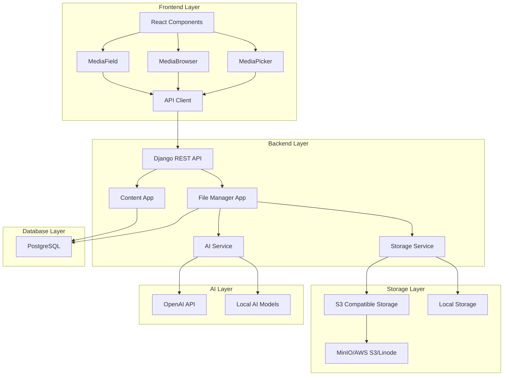

# Media System Technical Implementation Guide

> **Technical Documentation for eceee_v4 Media Management System**  
> **Version**: 1.0  
> **Last Updated**: December 2024  
> **For**: Developers, System Administrators, and Technical Teams

## 📋 Table of Contents

1. [Architecture Overview](#architecture-overview)
2. [Backend Implementation](#backend-implementation)
3. [Frontend Implementation](#frontend-implementation)
4. [Database Schema](#database-schema)
5. [Storage Integration](#storage-integration)
6. [AI Services Integration](#ai-services-integration)
7. [API Design Patterns](#api-design-patterns)
8. [Testing Strategy](#testing-strategy)
9. [Performance Optimization](#performance-optimization)
10. [Security Considerations](#security-considerations)
11. [Deployment Guide](#deployment-guide)
12. [Monitoring and Maintenance](#monitoring-and-maintenance)

## 🏗️ Architecture Overview

### System Architecture



### Technology Stack

#### **Backend Technologies**
- **Django 4.2+**: Web framework and ORM
- **Django REST Framework**: API development
- **PostgreSQL 15**: Primary database
- **Redis**: Caching and session storage
- **Celery**: Asynchronous task processing
- **Boto3**: AWS S3 integration
- **Pillow**: Image processing
- **OpenAI API**: AI content analysis

#### **Frontend Technologies**
- **React 19**: UI framework
- **Vite**: Build tool and dev server
- **Tailwind CSS**: Utility-first CSS framework
- **React Query**: Server state management
- **Zustand**: Client state management
- **Vitest**: Testing framework

#### **Infrastructure**
- **Docker**: Containerization
- **Docker Compose**: Development orchestration
- **MinIO**: S3-compatible local storage
- **Nginx**: Reverse proxy and static files

### Design Principles

#### **Separation of Concerns**
- **Backend**: Data management, business logic, API endpoints
- **Frontend**: User interface, user experience, client-side logic
- **Storage**: File storage, thumbnail generation, metadata extraction
- **AI**: Content analysis, tagging, text extraction

#### **Scalability**
- **Horizontal Scaling**: Stateless API design
- **Caching Strategy**: Redis for frequently accessed data
- **Async Processing**: Celery for heavy operations
- **CDN Integration**: S3-compatible storage with CDN support

#### **Maintainability**
- **Modular Architecture**: Separate Django apps for different concerns
- **Component-Based Frontend**: Reusable React components
- **Comprehensive Testing**: Unit, integration, and end-to-end tests
- **Documentation**: Extensive code and API documentation

## 🔧 Backend Implementation

### Django Apps Structure

```
backend/
├── file_manager/          # Core media management
│   ├── models.py         # Media models
│   ├── serializers.py    # API serializers
│   ├── views.py          # API views
│   ├── storage.py        # Storage integration
│   ├── ai_services.py    # AI integration
│   └── urls.py           # URL routing
├── content/              # Content and namespaces
│   ├── models.py         # Namespace models
│   └── ...
└── webpages/             # Page management
    ├── models.py         # Page models
    └── ...
```

### Core Models

#### **MediaFile Model**
```python
class MediaFile(models.Model):
    id = models.UUIDField(primary_key=True, default=uuid.uuid4)
    title = models.CharField(max_length=255)
    slug = models.SlugField(max_length=255)
    description = models.TextField(blank=True)
    
    # File information
    file_url = models.URLField(max_length=500)
    file_type = models.CharField(max_length=100)
    file_size = models.PositiveIntegerField()
    
    # Media dimensions (for images/videos)
    width = models.PositiveIntegerField(null=True, blank=True)
    height = models.PositiveIntegerField(null=True, blank=True)
    duration = models.FloatField(null=True, blank=True)
    
    # Relationships
    uploaded_by = models.ForeignKey(User, on_delete=models.CASCADE)
    namespace = models.ForeignKey('content.Namespace', on_delete=models.CASCADE)
    tags = models.ManyToManyField('MediaTag', blank=True)
    
    # Metadata
    metadata = models.JSONField(default=dict, blank=True)
    ai_analysis = models.JSONField(default=dict, blank=True)
    
    # Timestamps
    created_at = models.DateTimeField(auto_now_add=True)
    updated_at = models.DateTimeField(auto_now=True)
    
    class Meta:
        unique_together = ['slug', 'namespace']
        ordering = ['-created_at']
    
    @property
    def file_size_display(self):
        """Human-readable file size"""
        return self._format_file_size(self.file_size)
    
    @property
    def is_image(self):
        return self.file_type.startswith('image/')
    
    @property
    def is_video(self):
        return self.file_type.startswith('video/')
```

#### **MediaCollection Model**
```python
class MediaCollection(models.Model):
    id = models.UUIDField(primary_key=True, default=uuid.uuid4)
    title = models.CharField(max_length=255)
    slug = models.SlugField(max_length=255)
    description = models.TextField(blank=True)
    
    # Relationships
    files = models.ManyToManyField(MediaFile, blank=True)
    created_by = models.ForeignKey(User, on_delete=models.CASCADE)
    namespace = models.ForeignKey('content.Namespace', on_delete=models.CASCADE)
    
    # Metadata
    color = models.CharField(max_length=7, default='#3B82F6')  # Hex color
    is_public = models.BooleanField(default=False)
    
    # Timestamps
    created_at = models.DateTimeField(auto_now_add=True)
    updated_at = models.DateTimeField(auto_now=True)
    
    @property
    def file_count(self):
        return self.files.count()
    
    @property
    def total_size(self):
        return self.files.aggregate(
            total=models.Sum('file_size')
        )['total'] or 0
```

### API Views Implementation

#### **MediaFile ViewSet**
```python
class MediaFileViewSet(viewsets.ModelViewSet):
    serializer_class = MediaFileSerializer
    permission_classes = [IsAuthenticated]
    filter_backends = [DjangoFilterBackend, SearchFilter, OrderingFilter]
    filterset_class = MediaFileFilter
    search_fields = ['title', 'description', 'tags__name']
    ordering_fields = ['created_at', 'title', 'file_size']
    ordering = ['-created_at']
    
    def get_queryset(self):
        return MediaFile.objects.filter(
            namespace__in=self.request.user.accessible_namespaces.all()
        ).prefetch_related('tags', 'collections', 'thumbnails')
    
    def perform_create(self, serializer):
        serializer.save(uploaded_by=self.request.user)
    
    @action(detail=True, methods=['get'])
    def usage(self, request, pk=None):
        """Get usage information for a media file"""
        media_file = self.get_object()
        usage_data = MediaUsageService.get_usage_info(media_file)
        return Response(usage_data)
    
    @action(detail=False, methods=['post'])
    def bulk_tag(self, request):
        """Bulk tag multiple files"""
        serializer = BulkTagSerializer(data=request.data)
        serializer.is_valid(raise_exception=True)
        
        file_ids = serializer.validated_data['file_ids']
        tag_ids = serializer.validated_data['tag_ids']
        action = serializer.validated_data['action']
        
        files = self.get_queryset().filter(id__in=file_ids)
        tags = MediaTag.objects.filter(id__in=tag_ids)
        
        if action == 'add':
            for file in files:
                file.tags.add(*tags)
        elif action == 'remove':
            for file in files:
                file.tags.remove(*tags)
        
        return Response({'status': 'success', 'affected_files': len(files)})
```

#### **File Upload View**
```python
class FileUploadView(APIView):
    permission_classes = [IsAuthenticated]
    parser_classes = [MultiPartParser]
    
    def post(self, request):
        serializer = FileUploadSerializer(data=request.data)
        serializer.is_valid(raise_exception=True)
        
        uploaded_file = serializer.validated_data['file']
        namespace = serializer.validated_data.get('namespace')
        generate_ai_tags = serializer.validated_data.get('generate_ai_tags', True)
        
        # Validate file
        self._validate_file(uploaded_file)
        
        # Create media file record
        media_file = self._create_media_file(
            uploaded_file, request.user, namespace
        )
        
        # Process file asynchronously
        if generate_ai_tags:
            process_uploaded_file.delay(media_file.id)
        
        # Generate thumbnails
        generate_thumbnails.delay(media_file.id)
        
        return Response(
            MediaFileSerializer(media_file).data,
            status=status.HTTP_201_CREATED
        )
    
    def _validate_file(self, uploaded_file):
        # File size validation
        if uploaded_file.size > settings.MAX_FILE_SIZE:
            raise ValidationError("File too large")
        
        # File type validation
        if not self._is_allowed_file_type(uploaded_file.content_type):
            raise ValidationError("File type not supported")
    
    def _create_media_file(self, uploaded_file, user, namespace):
        # Generate unique filename
        filename = self._generate_unique_filename(uploaded_file.name)
        
        # Upload to storage
        storage = S3MediaStorage()
        file_path = storage.save(filename, uploaded_file)
        file_url = storage.url(file_path)
        
        # Extract metadata
        metadata = storage.extract_metadata(uploaded_file)
        
        # Create database record
        return MediaFile.objects.create(
            title=self._generate_title(uploaded_file.name),
            slug=self._generate_slug(uploaded_file.name),
            file_url=file_url,
            file_type=uploaded_file.content_type,
            file_size=uploaded_file.size,
            width=metadata.get('width'),
            height=metadata.get('height'),
            metadata=metadata,
            uploaded_by=user,
            namespace=namespace or user.default_namespace
        )
```

### Storage Integration

#### **S3MediaStorage Class**
```python
class S3MediaStorage(DefaultStorage):
    def __init__(self):
        self.bucket_name = settings.AWS_STORAGE_BUCKET_NAME
        self.region_name = settings.AWS_S3_REGION_NAME
        self.access_key = settings.AWS_ACCESS_KEY_ID
        self.secret_key = settings.AWS_SECRET_ACCESS_KEY
        self.endpoint_url = settings.AWS_S3_ENDPOINT_URL
        
        self.client = boto3.client(
            's3',
            region_name=self.region_name,
            aws_access_key_id=self.access_key,
            aws_secret_access_key=self.secret_key,
            endpoint_url=self.endpoint_url
        )
    
    def save(self, name, content, max_length=None):
        """Upload file to S3-compatible storage"""
        try:
            # Generate unique filename
            name = self._get_available_name(name, max_length)
            
            # Upload file
            self.client.upload_fileobj(
                content,
                self.bucket_name,
                name,
                ExtraArgs={
                    'ContentType': content.content_type,
                    'ACL': 'private'
                }
            )
            
            return name
        except Exception as e:
            logger.error(f"File upload failed: {e}")
            raise StorageError(f"Upload failed: {e}")
    
    def generate_thumbnails(self, media_file, file_content):
        """Generate thumbnails for images and videos"""
        if not media_file.is_image:
            return []
        
        thumbnails = []
        sizes = {
            'small': (150, 150),
            'medium': (300, 300),
            'large': (800, 800)
        }
        
        try:
            image = Image.open(file_content)
            
            for size_name, (width, height) in sizes.items():
                # Skip if original is smaller
                if image.width < width and image.height < height:
                    continue
                
                # Create thumbnail
                thumbnail = image.copy()
                thumbnail.thumbnail((width, height), Image.Resampling.LANCZOS)
                
                # Save thumbnail
                thumb_io = io.BytesIO()
                thumbnail.save(thumb_io, format='JPEG', quality=85)
                thumb_io.seek(0)
                
                thumb_name = f"thumbnails/{media_file.id}_{size_name}.jpg"
                thumb_path = self.save(thumb_name, thumb_io)
                thumb_url = self.url(thumb_path)
                
                # Create thumbnail record
                MediaThumbnail.objects.create(
                    media_file=media_file,
                    size=size_name,
                    width=thumbnail.width,
                    height=thumbnail.height,
                    file_url=thumb_url
                )
                
                thumbnails.append({
                    'size': size_name,
                    'url': thumb_url,
                    'width': thumbnail.width,
                    'height': thumbnail.height
                })
        
        except Exception as e:
            logger.error(f"Thumbnail generation failed: {e}")
        
        return thumbnails
```

### AI Services Integration

#### **MediaAIService Class**
```python
class MediaAIService:
    def __init__(self):
        self.openai_client = OpenAI(api_key=settings.OPENAI_API_KEY)
    
    def analyze_file(self, media_file, file_content):
        """Comprehensive AI analysis of media file"""
        analysis_results = {}
        
        if media_file.is_image:
            # Image content analysis
            analysis_results.update(
                self.analyze_image_content(file_content)
            )
            
            # Text extraction (OCR)
            analysis_results.update(
                self.extract_text_from_image(file_content)
            )
        
        # Generate title and tags
        analysis_results.update(
            self.generate_metadata(media_file, analysis_results)
        )
        
        return analysis_results
    
    def analyze_image_content(self, image_content):
        """Analyze image content using OpenAI Vision API"""
        try:
            # Encode image to base64
            image_base64 = base64.b64encode(image_content.read()).decode()
            
            response = self.openai_client.chat.completions.create(
                model="gpt-4-vision-preview",
                messages=[
                    {
                        "role": "user",
                        "content": [
                            {
                                "type": "text",
                                "text": "Analyze this image and provide: 1) A brief description, 2) Main objects/subjects, 3) Scene type, 4) Suggested tags for categorization. Return as JSON."
                            },
                            {
                                "type": "image_url",
                                "image_url": {
                                    "url": f"data:image/jpeg;base64,{image_base64}"
                                }
                            }
                        ]
                    }
                ],
                max_tokens=500
            )
            
            result = json.loads(response.choices[0].message.content)
            
            return {
                'description': result.get('description', ''),
                'objects': result.get('objects', []),
                'scene_type': result.get('scene_type', ''),
                'suggested_tags': result.get('suggested_tags', []),
                'confidence': 0.85  # Default confidence for OpenAI
            }
            
        except Exception as e:
            logger.error(f"AI image analysis failed: {e}")
            return self._get_fallback_analysis()
    
    def extract_text_from_image(self, image_content):
        """Extract text from images using OCR"""
        try:
            response = self.openai_client.chat.completions.create(
                model="gpt-4-vision-preview",
                messages=[
                    {
                        "role": "user",
                        "content": [
                            {
                                "type": "text",
                                "text": "Extract all visible text from this image. Return only the text content, preserving line breaks and formatting."
                            },
                            {
                                "type": "image_url",
                                "image_url": {
                                    "url": f"data:image/jpeg;base64,{base64.b64encode(image_content.read()).decode()}"
                                }
                            }
                        ]
                    }
                ],
                max_tokens=300
            )
            
            extracted_text = response.choices[0].message.content.strip()
            
            return {
                'extracted_text': extracted_text,
                'has_text': bool(extracted_text),
                'text_confidence': 0.9 if extracted_text else 0.0
            }
            
        except Exception as e:
            logger.error(f"Text extraction failed: {e}")
            return {'extracted_text': '', 'has_text': False, 'text_confidence': 0.0}
```

### Celery Tasks

#### **Asynchronous Processing**
```python
@shared_task
def process_uploaded_file(media_file_id):
    """Process uploaded file with AI analysis"""
    try:
        media_file = MediaFile.objects.get(id=media_file_id)
        
        # Download file content
        response = requests.get(media_file.file_url)
        file_content = io.BytesIO(response.content)
        
        # AI analysis
        ai_service = MediaAIService()
        analysis_results = ai_service.analyze_file(media_file, file_content)
        
        # Update media file with analysis
        media_file.ai_analysis = analysis_results
        media_file.save()
        
        # Auto-apply high-confidence tags
        auto_apply_tags(media_file, analysis_results)
        
        logger.info(f"Processed file {media_file_id} successfully")
        
    except Exception as e:
        logger.error(f"File processing failed for {media_file_id}: {e}")

@shared_task
def generate_thumbnails(media_file_id):
    """Generate thumbnails for media file"""
    try:
        media_file = MediaFile.objects.get(id=media_file_id)
        
        if not media_file.is_image:
            return
        
        # Download original file
        response = requests.get(media_file.file_url)
        file_content = io.BytesIO(response.content)
        
        # Generate thumbnails
        storage = S3MediaStorage()
        thumbnails = storage.generate_thumbnails(media_file, file_content)
        
        logger.info(f"Generated {len(thumbnails)} thumbnails for {media_file_id}")
        
    except Exception as e:
        logger.error(f"Thumbnail generation failed for {media_file_id}: {e}")

@shared_task
def cleanup_unused_files():
    """Clean up unused media files"""
    # Find files not referenced in any content
    unused_files = MediaFile.objects.filter(
        usage_count=0,
        created_at__lt=timezone.now() - timedelta(days=30)
    )
    
    deleted_count = 0
    for media_file in unused_files:
        # Double-check usage
        if MediaUsageService.get_usage_count(media_file) == 0:
            media_file.delete()
            deleted_count += 1
    
    logger.info(f"Cleaned up {deleted_count} unused files")
```

## 🎨 Frontend Implementation

### Component Architecture

```
frontend/src/components/
├── media/
│   ├── MediaPicker.jsx       # Modal for media selection
│   ├── MediaBrowser.jsx      # Grid/list view of media
│   ├── MediaCard.jsx         # Individual media file display
│   ├── MediaUpload.jsx       # File upload component
│   └── MediaSearch.jsx       # Search and filter controls
├── form-fields/
│   └── MediaField.jsx        # Schema-driven form field
└── widget-editors/
    ├── ImageEditor.jsx       # Image widget configuration
    ├── GalleryEditor.jsx     # Gallery widget configuration
    └── NewsEditor.jsx        # News widget configuration
```

### MediaPicker Component

#### **Core Implementation**
```jsx
import React, { useState, useCallback } from 'react';
import { useQuery } from '@tanstack/react-query';
import MediaBrowser from './MediaBrowser';
import MediaUpload from './MediaUpload';
import { searchMedia } from '../../api/media';

const MediaPicker = ({
  isOpen,
  onClose,
  onSelect,
  multiple = false,
  mediaTypes = [],
  namespace = null,
  allowUpload = true,
  maxItems = null
}) => {
  const [selectedFiles, setSelectedFiles] = useState([]);
  const [searchParams, setSearchParams] = useState({
    search: '',
    file_type: mediaTypes.length === 1 ? mediaTypes[0] : '',
    namespace: namespace,
    page: 1,
    page_size: 20
  });

  // Media query with React Query
  const {
    data: mediaData,
    isLoading,
    error,
    refetch
  } = useQuery({
    queryKey: ['media', searchParams],
    queryFn: () => searchMedia(searchParams),
    enabled: isOpen,
    staleTime: 5 * 60 * 1000, // 5 minutes
  });

  const handleFileSelect = useCallback((file) => {
    if (multiple) {
      setSelectedFiles(prev => {
        const isSelected = prev.some(f => f.id === file.id);
        if (isSelected) {
          return prev.filter(f => f.id !== file.id);
        } else {
          const newSelection = [...prev, file];
          if (maxItems && newSelection.length > maxItems) {
            return newSelection.slice(-maxItems);
          }
          return newSelection;
        }
      });
    } else {
      onSelect(file);
      onClose();
    }
  }, [multiple, maxItems, onSelect, onClose]);

  const handleConfirmSelection = useCallback(() => {
    onSelect(selectedFiles);
    onClose();
  }, [selectedFiles, onSelect, onClose]);

  const handleUploadComplete = useCallback((uploadedFile) => {
    refetch(); // Refresh media list
    if (!multiple) {
      onSelect(uploadedFile);
      onClose();
    }
  }, [multiple, onSelect, onClose, refetch]);

  if (!isOpen) return null;

  return (
    <div className="fixed inset-0 z-50 overflow-y-auto">
      <div className="flex items-center justify-center min-h-screen px-4">
        <div className="fixed inset-0 bg-black opacity-50" onClick={onClose} />
        
        <div className="relative bg-white rounded-lg shadow-xl max-w-6xl w-full max-h-[90vh] overflow-hidden">
          {/* Header */}
          <div className="flex items-center justify-between p-6 border-b">
            <h2 className="text-xl font-semibold">Select Media</h2>
            <button
              onClick={onClose}
              className="text-gray-400 hover:text-gray-600"
            >
              <XMarkIcon className="w-6 h-6" />
            </button>
          </div>

          {/* Content */}
          <div className="flex h-[calc(90vh-8rem)]">
            {/* Main Browser */}
            <div className="flex-1 overflow-hidden">
              <MediaBrowser
                data={mediaData}
                isLoading={isLoading}
                error={error}
                selectedFiles={selectedFiles}
                onFileSelect={handleFileSelect}
                onSearch={setSearchParams}
                searchParams={searchParams}
                multiple={multiple}
                mediaTypes={mediaTypes}
              />
            </div>

            {/* Upload Panel */}
            {allowUpload && (
              <div className="w-80 border-l bg-gray-50 p-4">
                <MediaUpload
                  namespace={namespace}
                  mediaTypes={mediaTypes}
                  onUploadComplete={handleUploadComplete}
                />
              </div>
            )}
          </div>

          {/* Footer */}
          {multiple && (
            <div className="flex items-center justify-between p-6 border-t bg-gray-50">
              <div className="text-sm text-gray-600">
                {selectedFiles.length} file{selectedFiles.length !== 1 ? 's' : ''} selected
                {maxItems && ` (max ${maxItems})`}
              </div>
              <div className="flex space-x-3">
                <button
                  onClick={onClose}
                  className="px-4 py-2 text-gray-600 border border-gray-300 rounded-md hover:bg-gray-50"
                >
                  Cancel
                </button>
                <button
                  onClick={handleConfirmSelection}
                  disabled={selectedFiles.length === 0}
                  className="px-4 py-2 bg-blue-600 text-white rounded-md hover:bg-blue-700 disabled:opacity-50"
                >
                  Confirm Selection
                </button>
              </div>
            </div>
          )}
        </div>
      </div>
    </div>
  );
};

export default MediaPicker;
```

### MediaBrowser Component

#### **Grid View Implementation**
```jsx
const MediaBrowser = ({
  data,
  isLoading,
  error,
  selectedFiles = [],
  onFileSelect,
  onSearch,
  searchParams,
  multiple = false,
  mediaTypes = []
}) => {
  const [viewMode, setViewMode] = useState('grid');
  const [sortBy, setSortBy] = useState('-created_at');

  const handleSearchChange = useCallback(
    debounce((searchTerm) => {
      onSearch(prev => ({ ...prev, search: searchTerm, page: 1 }));
    }, 300),
    [onSearch]
  );

  const handleFilterChange = useCallback((filterType, value) => {
    onSearch(prev => ({ ...prev, [filterType]: value, page: 1 }));
  }, [onSearch]);

  if (isLoading) {
    return (
      <div className="flex items-center justify-center h-64">
        <div className="animate-spin rounded-full h-8 w-8 border-b-2 border-blue-600" />
      </div>
    );
  }

  if (error) {
    return (
      <div className="flex flex-col items-center justify-center h-64 text-gray-500">
        <ExclamationTriangleIcon className="w-12 h-12 mb-4" />
        <p>Error loading media files</p>
        <button
          onClick={() => window.location.reload()}
          className="mt-2 text-blue-600 hover:text-blue-800"
        >
          Retry
        </button>
      </div>
    );
  }

  const files = data?.results || [];

  return (
    <div className="flex flex-col h-full">
      {/* Search and Filters */}
      <div className="p-4 border-b bg-white">
        <div className="flex items-center space-x-4 mb-4">
          <div className="flex-1">
            <input
              type="text"
              placeholder="Search media files..."
              className="w-full px-3 py-2 border border-gray-300 rounded-md"
              onChange={(e) => handleSearchChange(e.target.value)}
            />
          </div>
          <select
            value={searchParams.file_type || ''}
            onChange={(e) => handleFilterChange('file_type', e.target.value)}
            className="px-3 py-2 border border-gray-300 rounded-md"
          >
            <option value="">All Types</option>
            <option value="image">Images</option>
            <option value="video">Videos</option>
            <option value="document">Documents</option>
          </select>
        </div>

        <div className="flex items-center justify-between">
          <div className="flex items-center space-x-2">
            <button
              onClick={() => setViewMode('grid')}
              className={`p-2 rounded ${viewMode === 'grid' ? 'bg-blue-100 text-blue-600' : 'text-gray-400'}`}
            >
              <Squares2X2Icon className="w-5 h-5" />
            </button>
            <button
              onClick={() => setViewMode('list')}
              className={`p-2 rounded ${viewMode === 'list' ? 'bg-blue-100 text-blue-600' : 'text-gray-400'}`}
            >
              <ListBulletIcon className="w-5 h-5" />
            </button>
          </div>

          <select
            value={sortBy}
            onChange={(e) => setSortBy(e.target.value)}
            className="px-3 py-2 text-sm border border-gray-300 rounded-md"
          >
            <option value="-created_at">Newest First</option>
            <option value="created_at">Oldest First</option>
            <option value="title">Name A-Z</option>
            <option value="-title">Name Z-A</option>
            <option value="-file_size">Largest First</option>
            <option value="file_size">Smallest First</option>
          </select>
        </div>
      </div>

      {/* Media Grid */}
      <div className="flex-1 overflow-y-auto p-4">
        {files.length === 0 ? (
          <div className="flex flex-col items-center justify-center h-64 text-gray-500">
            <PhotoIcon className="w-16 h-16 mb-4" />
            <p className="text-lg font-medium">No media files found</p>
            <p className="text-sm">Try adjusting your search or filters</p>
          </div>
        ) : (
          <div className={`grid gap-4 ${
            viewMode === 'grid' 
              ? 'grid-cols-2 sm:grid-cols-3 md:grid-cols-4 lg:grid-cols-5' 
              : 'grid-cols-1'
          }`}>
            {files.map((file) => (
              <MediaCard
                key={file.id}
                file={file}
                isSelected={selectedFiles.some(f => f.id === file.id)}
                onSelect={() => onFileSelect(file)}
                viewMode={viewMode}
                showCheckbox={multiple}
              />
            ))}
          </div>
        )}
      </div>

      {/* Pagination */}
      {data?.next || data?.previous ? (
        <div className="flex items-center justify-between p-4 border-t bg-gray-50">
          <button
            onClick={() => onSearch(prev => ({ ...prev, page: prev.page - 1 }))}
            disabled={!data.previous}
            className="px-3 py-2 text-sm border border-gray-300 rounded-md disabled:opacity-50"
          >
            Previous
          </button>
          <span className="text-sm text-gray-600">
            Page {searchParams.page} of {Math.ceil(data.count / searchParams.page_size)}
          </span>
          <button
            onClick={() => onSearch(prev => ({ ...prev, page: prev.page + 1 }))}
            disabled={!data.next}
            className="px-3 py-2 text-sm border border-gray-300 rounded-md disabled:opacity-50"
          >
            Next
          </button>
        </div>
      ) : null}
    </div>
  );
};
```

### State Management

#### **Media Store with Zustand**
```javascript
import { create } from 'zustand';
import { devtools } from 'zustand/middleware';

const useMediaStore = create(
  devtools(
    (set, get) => ({
      // State
      selectedFiles: [],
      uploadProgress: {},
      searchHistory: [],
      recentFiles: [],
      
      // Actions
      setSelectedFiles: (files) => set({ selectedFiles: files }),
      
      addSelectedFile: (file) => set((state) => ({
        selectedFiles: [...state.selectedFiles, file]
      })),
      
      removeSelectedFile: (fileId) => set((state) => ({
        selectedFiles: state.selectedFiles.filter(f => f.id !== fileId)
      })),
      
      clearSelection: () => set({ selectedFiles: [] }),
      
      updateUploadProgress: (fileId, progress) => set((state) => ({
        uploadProgress: {
          ...state.uploadProgress,
          [fileId]: progress
        }
      })),
      
      addToSearchHistory: (searchTerm) => set((state) => ({
        searchHistory: [
          searchTerm,
          ...state.searchHistory.filter(term => term !== searchTerm)
        ].slice(0, 10)
      })),
      
      addRecentFile: (file) => set((state) => ({
        recentFiles: [
          file,
          ...state.recentFiles.filter(f => f.id !== file.id)
        ].slice(0, 20)
      }))
    }),
    { name: 'media-store' }
  )
);

export default useMediaStore;
```

## 🗄️ Database Schema

### Core Tables

#### **Media Files Table**
```sql
CREATE TABLE file_manager_mediafile (
    id UUID PRIMARY KEY DEFAULT gen_random_uuid(),
    title VARCHAR(255) NOT NULL,
    slug VARCHAR(255) NOT NULL,
    description TEXT,
    file_url VARCHAR(500) NOT NULL,
    file_type VARCHAR(100) NOT NULL,
    file_size INTEGER NOT NULL CHECK (file_size > 0),
    width INTEGER CHECK (width > 0),
    height INTEGER CHECK (height > 0),
    duration FLOAT CHECK (duration > 0),
    metadata JSONB DEFAULT '{}',
    ai_analysis JSONB DEFAULT '{}',
    uploaded_by_id INTEGER NOT NULL REFERENCES auth_user(id),
    namespace_id UUID NOT NULL REFERENCES content_namespace(id),
    created_at TIMESTAMP WITH TIME ZONE DEFAULT NOW(),
    updated_at TIMESTAMP WITH TIME ZONE DEFAULT NOW(),
    
    UNIQUE(slug, namespace_id)
);

-- Indexes for performance
CREATE INDEX idx_mediafile_namespace ON file_manager_mediafile(namespace_id);
CREATE INDEX idx_mediafile_uploaded_by ON file_manager_mediafile(uploaded_by_id);
CREATE INDEX idx_mediafile_file_type ON file_manager_mediafile(file_type);
CREATE INDEX idx_mediafile_created_at ON file_manager_mediafile(created_at DESC);
CREATE INDEX idx_mediafile_file_size ON file_manager_mediafile(file_size);
CREATE INDEX idx_mediafile_metadata ON file_manager_mediafile USING GIN(metadata);
CREATE INDEX idx_mediafile_ai_analysis ON file_manager_mediafile USING GIN(ai_analysis);

-- Full-text search index
CREATE INDEX idx_mediafile_search ON file_manager_mediafile USING GIN(
    to_tsvector('english', title || ' ' || COALESCE(description, ''))
);
```

#### **Collections Table**
```sql
CREATE TABLE file_manager_mediacollection (
    id UUID PRIMARY KEY DEFAULT gen_random_uuid(),
    title VARCHAR(255) NOT NULL,
    slug VARCHAR(255) NOT NULL,
    description TEXT,
    color VARCHAR(7) DEFAULT '#3B82F6',
    is_public BOOLEAN DEFAULT FALSE,
    created_by_id INTEGER NOT NULL REFERENCES auth_user(id),
    namespace_id UUID NOT NULL REFERENCES content_namespace(id),
    created_at TIMESTAMP WITH TIME ZONE DEFAULT NOW(),
    updated_at TIMESTAMP WITH TIME ZONE DEFAULT NOW(),
    
    UNIQUE(slug, namespace_id)
);

-- Many-to-many relationship table
CREATE TABLE file_manager_mediacollection_files (
    id SERIAL PRIMARY KEY,
    mediacollection_id UUID REFERENCES file_manager_mediacollection(id) ON DELETE CASCADE,
    mediafile_id UUID REFERENCES file_manager_mediafile(id) ON DELETE CASCADE,
    added_at TIMESTAMP WITH TIME ZONE DEFAULT NOW(),
    
    UNIQUE(mediacollection_id, mediafile_id)
);
```

#### **Tags Table**
```sql
CREATE TABLE file_manager_mediatag (
    id UUID PRIMARY KEY DEFAULT gen_random_uuid(),
    name VARCHAR(100) NOT NULL,
    slug VARCHAR(100) NOT NULL,
    description TEXT,
    color VARCHAR(7) DEFAULT '#10B981',
    namespace_id UUID NOT NULL REFERENCES content_namespace(id),
    created_at TIMESTAMP WITH TIME ZONE DEFAULT NOW(),
    
    UNIQUE(slug, namespace_id)
);

-- Many-to-many relationship table
CREATE TABLE file_manager_mediafile_tags (
    id SERIAL PRIMARY KEY,
    mediafile_id UUID REFERENCES file_manager_mediafile(id) ON DELETE CASCADE,
    mediatag_id UUID REFERENCES file_manager_mediatag(id) ON DELETE CASCADE,
    
    UNIQUE(mediafile_id, mediatag_id)
);
```

#### **Thumbnails Table**
```sql
CREATE TABLE file_manager_mediathumbnail (
    id UUID PRIMARY KEY DEFAULT gen_random_uuid(),
    media_file_id UUID NOT NULL REFERENCES file_manager_mediafile(id) ON DELETE CASCADE,
    size VARCHAR(20) NOT NULL,
    width INTEGER NOT NULL CHECK (width > 0),
    height INTEGER NOT NULL CHECK (height > 0),
    file_url VARCHAR(500) NOT NULL,
    created_at TIMESTAMP WITH TIME ZONE DEFAULT NOW(),
    
    UNIQUE(media_file_id, size)
);
```

### Performance Optimizations

#### **Database Views**
```sql
-- Media file with aggregated data
CREATE VIEW media_file_summary AS
SELECT 
    mf.*,
    COUNT(DISTINCT mt.id) as tag_count,
    COUNT(DISTINCT mc.id) as collection_count,
    COUNT(DISTINCT mth.id) as thumbnail_count,
    ARRAY_AGG(DISTINCT mt.name) FILTER (WHERE mt.name IS NOT NULL) as tag_names
FROM file_manager_mediafile mf
LEFT JOIN file_manager_mediafile_tags mft ON mf.id = mft.mediafile_id
LEFT JOIN file_manager_mediatag mt ON mft.mediatag_id = mt.id
LEFT JOIN file_manager_mediacollection_files mcf ON mf.id = mcf.mediafile_id
LEFT JOIN file_manager_mediacollection mc ON mcf.mediacollection_id = mc.id
LEFT JOIN file_manager_mediathumbnail mth ON mf.id = mth.media_file_id
GROUP BY mf.id;
```

#### **Materialized Views for Analytics**
```sql
-- Storage usage by namespace
CREATE MATERIALIZED VIEW storage_usage_by_namespace AS
SELECT 
    n.id as namespace_id,
    n.name as namespace_name,
    COUNT(mf.id) as file_count,
    SUM(mf.file_size) as total_size,
    AVG(mf.file_size) as avg_file_size,
    COUNT(CASE WHEN mf.file_type LIKE 'image/%' THEN 1 END) as image_count,
    COUNT(CASE WHEN mf.file_type LIKE 'video/%' THEN 1 END) as video_count,
    COUNT(CASE WHEN mf.file_type LIKE 'application/%' THEN 1 END) as document_count
FROM content_namespace n
LEFT JOIN file_manager_mediafile mf ON n.id = mf.namespace_id
GROUP BY n.id, n.name;

-- Refresh materialized view periodically
CREATE OR REPLACE FUNCTION refresh_storage_stats()
RETURNS void AS $$
BEGIN
    REFRESH MATERIALIZED VIEW storage_usage_by_namespace;
END;
$$ LANGUAGE plpgsql;
```

## 🔒 Security Considerations

### Authentication and Authorization

#### **Token-Based Authentication**
```python
# settings.py
REST_FRAMEWORK = {
    'DEFAULT_AUTHENTICATION_CLASSES': [
        'rest_framework.authentication.TokenAuthentication',
        'rest_framework.authentication.SessionAuthentication',
    ],
    'DEFAULT_PERMISSION_CLASSES': [
        'rest_framework.permissions.IsAuthenticated',
    ],
}

# Custom permission classes
class MediaFilePermission(BasePermission):
    def has_permission(self, request, view):
        return request.user.is_authenticated
    
    def has_object_permission(self, request, view, obj):
        # Check namespace access
        if not request.user.accessible_namespaces.filter(id=obj.namespace_id).exists():
            return False
        
        # Read permissions
        if request.method in SAFE_METHODS:
            return True
        
        # Write permissions
        if request.method in ['PUT', 'PATCH']:
            return (
                obj.uploaded_by == request.user or 
                request.user.has_perm('file_manager.change_mediafile')
            )
        
        # Delete permissions
        if request.method == 'DELETE':
            return (
                obj.uploaded_by == request.user or 
                request.user.has_perm('file_manager.delete_mediafile')
            )
        
        return False
```

### File Upload Security

#### **File Validation**
```python
class FileUploadValidator:
    ALLOWED_TYPES = {
        'image/jpeg', 'image/png', 'image/gif', 'image/webp', 'image/svg+xml',
        'video/mp4', 'video/webm', 'video/avi', 'video/quicktime',
        'application/pdf', 'application/msword', 'text/plain',
        'audio/mpeg', 'audio/wav', 'audio/ogg'
    }
    
    MAX_FILE_SIZE = 100 * 1024 * 1024  # 100MB
    
    @classmethod
    def validate_file(cls, uploaded_file):
        # File size check
        if uploaded_file.size > cls.MAX_FILE_SIZE:
            raise ValidationError(f"File size exceeds {cls.MAX_FILE_SIZE} bytes")
        
        # Content type check
        if uploaded_file.content_type not in cls.ALLOWED_TYPES:
            raise ValidationError(f"File type {uploaded_file.content_type} not allowed")
        
        # File extension check
        ext = os.path.splitext(uploaded_file.name)[1].lower()
        allowed_extensions = {
            '.jpg', '.jpeg', '.png', '.gif', '.webp', '.svg',
            '.mp4', '.webm', '.avi', '.mov',
            '.pdf', '.doc', '.docx', '.txt',
            '.mp3', '.wav', '.ogg'
        }
        if ext not in allowed_extensions:
            raise ValidationError(f"File extension {ext} not allowed")
        
        # Magic number validation for images
        if uploaded_file.content_type.startswith('image/'):
            cls._validate_image_content(uploaded_file)
    
    @classmethod
    def _validate_image_content(cls, uploaded_file):
        try:
            image = Image.open(uploaded_file)
            image.verify()
        except Exception:
            raise ValidationError("Invalid image file")
```

### Storage Security

#### **S3 Security Configuration**
```python
# S3 bucket policy for private files
BUCKET_POLICY = {
    "Version": "2012-10-17",
    "Statement": [
        {
            "Sid": "DenyPublicAccess",
            "Effect": "Deny",
            "Principal": "*",
            "Action": "s3:GetObject",
            "Resource": "arn:aws:s3:::your-bucket/*",
            "Condition": {
                "StringNotEquals": {
                    "aws:PrincipalServiceName": "cloudfront.amazonaws.com"
                }
            }
        }
    ]
}

# Signed URL generation for secure access
class SecureMediaStorage(S3MediaStorage):
    def generate_signed_url(self, file_path, expiration=3600):
        """Generate signed URL for secure file access"""
        return self.client.generate_presigned_url(
            'get_object',
            Params={'Bucket': self.bucket_name, 'Key': file_path},
            ExpiresIn=expiration
        )
    
    def url(self, name):
        """Override to return signed URLs for private files"""
        if settings.MEDIA_FILES_PRIVATE:
            return self.generate_signed_url(name)
        return super().url(name)
```

### Data Privacy

#### **GDPR Compliance**
```python
class MediaFileGDPRMixin:
    def anonymize_user_data(self, user):
        """Anonymize media files when user requests data deletion"""
        MediaFile.objects.filter(uploaded_by=user).update(
            uploaded_by=None,
            metadata=models.F('metadata') - 'user_info'
        )
    
    def export_user_data(self, user):
        """Export user's media data for GDPR compliance"""
        files = MediaFile.objects.filter(uploaded_by=user)
        return {
            'media_files': [
                {
                    'title': f.title,
                    'file_type': f.file_type,
                    'file_size': f.file_size,
                    'created_at': f.created_at.isoformat(),
                    'tags': [t.name for t in f.tags.all()]
                }
                for f in files
            ]
        }
```

## 🚀 Deployment Guide

### Docker Configuration

#### **Production Dockerfile**
```dockerfile
# Backend Dockerfile
FROM python:3.11-slim

WORKDIR /app

# Install system dependencies
RUN apt-get update && apt-get install -y \
    libpq-dev \
    gcc \
    && rm -rf /var/lib/apt/lists/*

# Install Python dependencies
COPY requirements.txt .
RUN pip install --no-cache-dir -r requirements.txt

# Copy application code
COPY . .

# Collect static files
RUN python manage.py collectstatic --noinput

# Run application
CMD ["gunicorn", "--bind", "0.0.0.0:8000", "config.wsgi:application"]
```

#### **Production Docker Compose**
```yaml
version: '3.8'

services:
  db:
    image: postgres:15
    environment:
      POSTGRES_DB: eceee_v4
      POSTGRES_USER: postgres
      POSTGRES_PASSWORD: ${DB_PASSWORD}
    volumes:
      - postgres_data:/var/lib/postgresql/data
    restart: unless-stopped

  redis:
    image: redis:7-alpine
    restart: unless-stopped

  backend:
    build: ./backend
    environment:
      - DATABASE_URL=postgresql://postgres:${DB_PASSWORD}@db:5432/eceee_v4
      - REDIS_URL=redis://redis:6379/0
      - AWS_ACCESS_KEY_ID=${AWS_ACCESS_KEY_ID}
      - AWS_SECRET_ACCESS_KEY=${AWS_SECRET_ACCESS_KEY}
      - AWS_STORAGE_BUCKET_NAME=${AWS_STORAGE_BUCKET_NAME}
      - OPENAI_API_KEY=${OPENAI_API_KEY}
    depends_on:
      - db
      - redis
    restart: unless-stopped

  celery:
    build: ./backend
    command: celery -A config worker -l info
    environment:
      - DATABASE_URL=postgresql://postgres:${DB_PASSWORD}@db:5432/eceee_v4
      - REDIS_URL=redis://redis:6379/0
    depends_on:
      - db
      - redis
    restart: unless-stopped

  frontend:
    build: ./frontend
    ports:
      - "80:80"
    restart: unless-stopped

volumes:
  postgres_data:
```

### Environment Configuration

#### **Production Settings**
```python
# settings/production.py
import os
from .base import *

DEBUG = False
ALLOWED_HOSTS = os.environ.get('ALLOWED_HOSTS', '').split(',')

# Database
DATABASES = {
    'default': dj_database_url.parse(os.environ['DATABASE_URL'])
}

# Cache
CACHES = {
    'default': {
        'BACKEND': 'django_redis.cache.RedisCache',
        'LOCATION': os.environ['REDIS_URL'],
        'OPTIONS': {
            'CLIENT_CLASS': 'django_redis.client.DefaultClient',
        }
    }
}

# Storage
AWS_ACCESS_KEY_ID = os.environ['AWS_ACCESS_KEY_ID']
AWS_SECRET_ACCESS_KEY = os.environ['AWS_SECRET_ACCESS_KEY']
AWS_STORAGE_BUCKET_NAME = os.environ['AWS_STORAGE_BUCKET_NAME']
AWS_S3_REGION_NAME = os.environ.get('AWS_S3_REGION_NAME', 'us-east-1')
AWS_S3_CUSTOM_DOMAIN = os.environ.get('AWS_S3_CUSTOM_DOMAIN')

# Security
SECURE_SSL_REDIRECT = True
SECURE_HSTS_SECONDS = 31536000
SECURE_HSTS_INCLUDE_SUBDOMAINS = True
SECURE_HSTS_PRELOAD = True
SECURE_CONTENT_TYPE_NOSNIFF = True
SECURE_BROWSER_XSS_FILTER = True

# Logging
LOGGING = {
    'version': 1,
    'disable_existing_loggers': False,
    'handlers': {
        'file': {
            'level': 'INFO',
            'class': 'logging.FileHandler',
            'filename': '/var/log/django/media_system.log',
        },
    },
    'loggers': {
        'file_manager': {
            'handlers': ['file'],
            'level': 'INFO',
            'propagate': True,
        },
    },
}
```

### Monitoring and Health Checks

#### **Health Check Endpoints**
```python
# health/views.py
from django.http import JsonResponse
from django.db import connection
from django.core.cache import cache
import redis
import boto3

def health_check(request):
    """Comprehensive health check"""
    status = {
        'status': 'healthy',
        'timestamp': timezone.now().isoformat(),
        'services': {}
    }
    
    # Database check
    try:
        with connection.cursor() as cursor:
            cursor.execute("SELECT 1")
        status['services']['database'] = 'healthy'
    except Exception as e:
        status['services']['database'] = f'unhealthy: {e}'
        status['status'] = 'unhealthy'
    
    # Redis check
    try:
        cache.set('health_check', 'ok', 10)
        cache.get('health_check')
        status['services']['redis'] = 'healthy'
    except Exception as e:
        status['services']['redis'] = f'unhealthy: {e}'
        status['status'] = 'unhealthy'
    
    # S3 check
    try:
        s3_client = boto3.client('s3')
        s3_client.head_bucket(Bucket=settings.AWS_STORAGE_BUCKET_NAME)
        status['services']['s3'] = 'healthy'
    except Exception as e:
        status['services']['s3'] = f'unhealthy: {e}'
        status['status'] = 'unhealthy'
    
    return JsonResponse(status)

def media_stats(request):
    """Media system statistics"""
    stats = {
        'total_files': MediaFile.objects.count(),
        'total_size': MediaFile.objects.aggregate(
            total=models.Sum('file_size')
        )['total'] or 0,
        'files_by_type': dict(
            MediaFile.objects.values('file_type').annotate(
                count=models.Count('id')
            ).values_list('file_type', 'count')
        ),
        'recent_uploads': MediaFile.objects.filter(
            created_at__gte=timezone.now() - timedelta(hours=24)
        ).count()
    }
    
    return JsonResponse(stats)
```

---

## 📊 Performance Monitoring

### Metrics Collection

#### **Custom Metrics**
```python
# metrics/collectors.py
from prometheus_client import Counter, Histogram, Gauge
import time

# Metrics
upload_counter = Counter('media_uploads_total', 'Total file uploads', ['file_type', 'status'])
upload_duration = Histogram('media_upload_duration_seconds', 'Upload duration')
storage_usage = Gauge('media_storage_bytes', 'Storage usage in bytes', ['namespace'])
ai_analysis_duration = Histogram('ai_analysis_duration_seconds', 'AI analysis duration')

class MediaMetricsMiddleware:
    def __init__(self, get_response):
        self.get_response = get_response
    
    def __call__(self, request):
        start_time = time.time()
        response = self.get_response(request)
        
        # Track upload metrics
        if request.path.startswith('/api/v1/media/upload/'):
            duration = time.time() - start_time
            upload_duration.observe(duration)
            
            if response.status_code == 201:
                upload_counter.labels(
                    file_type=request.POST.get('file_type', 'unknown'),
                    status='success'
                ).inc()
            else:
                upload_counter.labels(
                    file_type='unknown',
                    status='error'
                ).inc()
        
        return response
```

This comprehensive technical guide provides developers with everything needed to understand, implement, maintain, and extend the eceee_v4 Media Management System. The architecture is designed for scalability, security, and maintainability while providing a rich user experience through modern frontend technologies.

---

## 📞 Technical Support

For technical questions and implementation support:
- **API Documentation**: [Media System API Documentation](./MEDIA_SYSTEM_API_DOCUMENTATION.md)
- **User Guide**: [Media System User Guide](./MEDIA_SYSTEM_USER_GUIDE.md)
- **GitHub Issues**: Create technical issues in the project repository
- **Developer Email**: dev-support@eceee.example.com
