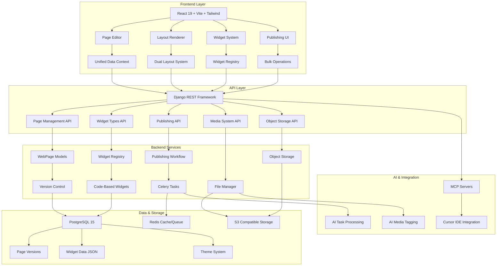
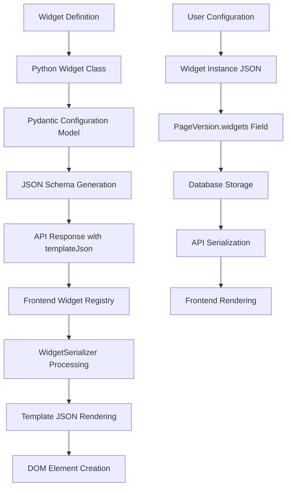
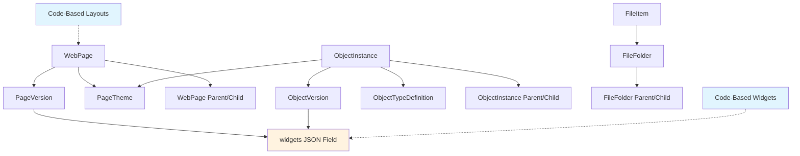
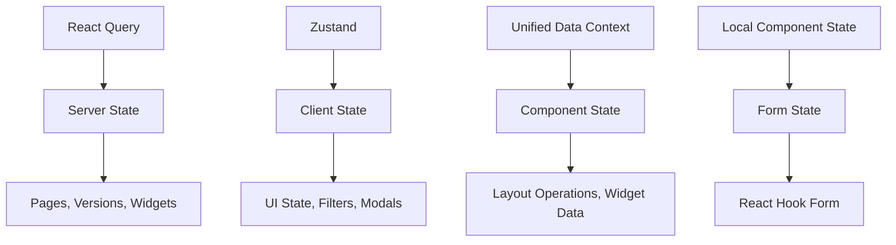

# ECEEE v4 System Overview

> **Current Architecture Documentation**  
> **Status**: ✅ Updated to Match Current Codebase  
> **Last Updated**: December 2024  
> **Version**: 2.0

## Introduction

ECEEE v4 is a comprehensive AI-integrated content management system designed for modern web development. The system provides enterprise-level features including advanced version control, dual layout systems, comprehensive widget management, publishing workflows, and professional CMS capabilities with 100% test coverage.

## System Architecture

### High-Level Architecture



### Current Technology Stack

#### **Frontend (React 19 Ecosystem)**
- **React 19** - Latest React with concurrent features
- **Vite** - Fast build system with HMR
- **Tailwind CSS v4** - Utility-first styling
- **Zustand** - Lightweight state management
- **React Query** - Server state management and caching
- **React Hook Form** - Form handling and validation
- **Vitest** - Testing framework (100% success rate)

#### **Backend (Django Ecosystem)**
- **Django 4.2+** - Web framework with security updates
- **Django REST Framework** - API development
- **PostgreSQL 15** - Primary database with UUID support
- **Redis** - Caching, sessions, and task queue
- **Celery** - Background task processing
- **Pydantic** - Data validation and widget schemas
- **Boto3** - S3 storage integration

#### **Infrastructure & AI**
- **Docker Compose** - Development environment orchestration
- **MCP Protocol** - Model Context Protocol for AI integration
- **Cursor IDE** - AI-powered development environment
- **GitHub Projects** - Task management and workflow tracking

## Core Systems

### 1. Dual Layout System ⚡

#### Purpose
**Current Reality**: The system implements TWO separate layout systems that work in parallel but are not automatically synchronized.

#### Architecture Overview
```mermaid
graph LR
    subgraph "Backend Layout System"
        A[Python Layout Classes] --> B[BaseLayout]
        B --> C[slot_configuration]
        C --> D[Django Templates]
        D --> E[]
    end
    
    subgraph "Frontend Layout System"
        F[React Components] --> G[LayoutRegistry.jsx]
        G --> H[WidgetSlot Components]
        H --> I[Layout Rendering]
    end
    
    subgraph "Rendering Engines"
        J[LayoutRenderer.js] --> K[Vanilla JS DOM]
        L[ReactLayoutRenderer.jsx] --> M[React Components]
    end
    
    E --> N[Public Pages]
    I --> O[Page Editor]
    K --> P[Preview Mode]
    M --> Q[Edit Mode]
```

#### Backend Layout System
**Code-Based Layout Classes** in `backend/webpages/layouts.py`:
```python
@register_layout
class SingleColumnLayout(BaseLayout):
    name = "single_column"
    template_name = "webpages/layouts/single_column.html"
    
    @property
    def slot_configuration(self):
        return {
            "slots": [
                {"name": "main", "title": "Main Content", "max_widgets": None},
                {"name": "sidebar", "title": "Sidebar", "max_widgets": 4}
            ]
        }
```

#### Frontend Layout System
**React Layout Components** in `frontend/src/editors/page-editor/layouts/LayoutRegistry.jsx`:
```jsx
export const SingleColumnLayout = ({ widgets, onWidgetAction, editable }) => (
    <div className="single-column-layout">
        <WidgetSlot name="main" widgets={widgets.main || []} />
    </div>
);

export const LAYOUT_REGISTRY = {
    'single_column': { component: SingleColumnLayout, slots: ['main'] }
};
```

#### ⚠️ Current Issues
- **No Automatic Synchronization**: Backend and frontend layouts must be manually kept in sync
- **Dual Maintenance**: Changes require updates in both Python and React code
- **Configuration Drift**: Slot configurations can become inconsistent

### 2. Widget System with Serialization ⚙️

#### Current Reality
**Widget serialization is extensively used** despite documentation suggesting otherwise.

#### Widget Data Flow


#### Key Components

**Backend Widget Registry** (`backend/webpages/widget_registry.py`):
- **BaseWidget**: Abstract base class for all widgets
- **Auto-discovery**: Widgets automatically registered from Django apps
- **Template JSON**: Widgets can be serialized to JSON templates
- **Pydantic Validation**: Configuration schemas with type safety

**Frontend Rendering** (`frontend/src/components/LayoutRenderer.js`):
- **Template JSON Caching**: Performance optimization for widget templates
- **Dual Rendering**: Template JSON + Legacy fallback approaches
- **Widget Content Rendering**: `renderFromTemplateJsonCached()` method

#### Widget Storage Format
```json
{
  "main": [
    {
      "type": "core_widgets.ContentWidget",
      "config": {"content": "Hello World", "format": "html"},
      "id": "widget-123"
    }
  ],
  "sidebar": [
    {
      "type": "core_widgets.ImageWidget", 
      "config": {"url": "/media/image.jpg", "alt": "Example"},
      "id": "widget-456"
    }
  ]
}
```

### 3. Publishing Workflow System 📝

#### Purpose
Professional-grade content management with scheduling and bulk operations.

#### Key Features
- **Scheduled Publishing**: Queue content for future publication
- **Bulk Operations**: Mass publish/schedule multiple pages
- **Publication Status Dashboard**: Real-time monitoring
- **Timeline View**: Visual publication calendar
- **Automated Processing**: Celery-based background tasks

#### API Endpoints
- `POST /api/webpages/pages/{id}/schedule/` - Schedule publication
- `POST /api/webpages/pages/bulk_publish/` - Bulk publishing operations
- `POST /api/webpages/pages/bulk_schedule/` - Bulk scheduling
- `GET /api/webpages/pages/publication_status/` - Status monitoring

### 4. Version Control System 📚

#### Purpose
Comprehensive version control for web pages enabling draft/published workflows, change tracking, and content restoration.

#### Current Implementation
**Backend Models:**
- `PageVersion`: Stores complete page snapshots with metadata
- Version statuses: `draft`, `published`, `archived`
- User attribution and timestamps
- Change summaries and descriptions

**API Endpoints:**
- `GET /api/webpages/versions/` - List and filter versions
- `POST /api/webpages/versions/{id}/publish/` - Publish draft versions
- `POST /api/webpages/versions/{id}/create_draft/` - Create drafts from published
- `POST /api/webpages/versions/{id}/restore/` - Restore previous versions
- `GET /api/webpages/versions/compare/` - Compare version differences

**Frontend Interface:**
- Version management modal with statistics dashboard
- Visual version cards with status indicators
- One-click publish, restore, and comparison actions
- Advanced filtering and search capabilities

#### Workflow
1. **Content Creation**: Users edit pages creating automatic draft versions
2. **Review Process**: Drafts can be previewed and compared with published versions
3. **Publishing**: Drafts are published to become live content
4. **History Management**: Complete audit trail maintained for all changes
5. **Recovery**: Any version can be restored as current content

### 5. Theme System 🎨

#### Purpose
CSS variable-based theming with inheritance and custom styling capabilities.

#### Key Components
- **CSS Variables**: Dynamic theming through CSS custom properties
- **Custom CSS**: Additional styling support per theme
- **Theme Inheritance**: Automatic propagation down page hierarchy
- **Real-time Preview**: Live theme changes in editor interface
- **Image Styles**: Named image styling configurations for widgets

### 6. Media System 📁

#### Purpose
Comprehensive media management with AI-powered features and S3 storage.

#### Key Features
- **S3 Compatible Storage**: MinIO, AWS S3, or Linode Object Storage
- **AI-Powered Tagging**: Automatic content analysis and tagging
- **React Integration**: MediaPicker, MediaBrowser components
- **File Management**: Upload, organize, and manage media assets
- **API Integration**: RESTful API for media operations

### 3. Widget System

#### Purpose
Reusable, configurable page components with full versioning support and code-based type definitions.

#### Key Components

**Code-Based Widget Types:**
- Pydantic model-based configuration validation
- Auto-generated JSON schemas from Pydantic models
- Template-based rendering with Django templates
- Type safety and compile-time validation
- Automatic discovery from Django apps
- No database queries for widget type definitions

**Widget Management:**
- Drag-and-drop placement via frontend interface
- Slot-based organization within page layouts
- Sort order management with intuitive controls
- Configuration persistence in JSON format
- Real-time configuration validation

**Widget Inheritance:**
- Inherit widgets from parent pages automatically
- Override inherited widgets with local configurations
- Add page-specific widgets independently
- Complete change tracking and version history
- Granular inheritance control per widget

### 4. Template System

#### Purpose
Standardized template architecture with flexible layout rendering and theme integration.

#### Key Components

**Base Template Architecture:**
- `base_eceee.html` - Primary base template with modern web standards
- Tailwind CSS integration for utility-first styling
- HTMX for progressive enhancement and dynamic interactions
- Alpine.js for lightweight JavaScript functionality
- Consistent navigation and responsive design structure

**Layout Template System:**
- Custom template selection via PageLayout `template_name` field
- Defaults to `webpages/page_detail.html` for backward compatibility
- Support for layout-specific template files
- Template inheritance from base_eceee.html
- Automatic theme and CSS variable injection

**Template Features:**
- Dynamic CSS variable injection from PageTheme
- Custom CSS support with safe rendering
- Layout-specific CSS classes from PageLayout
- Breadcrumb navigation with hierarchical structure
- SEO-optimized meta tags and structured data
- Child page navigation and discovery
- Widget slot rendering with inheritance tracking

## Data Models

### Current Database Schema

#### Page Management Models

```python
# Core Page Model
WebPage (MPTT Model for Hierarchy)
├── id (UUID)
├── title, slug, description
├── parent (self-referential hierarchy)
├── layout_name (CharField) - references code-based layout
├── theme (FK to PageTheme, nullable)
├── publish_date, unpublish_date
├── is_published (computed property)
├── created_by, updated_by (FK to User)
├── created_at, updated_at
├── level, lft, rght, tree_id (MPTT fields)
└── metadata (JSONField)

# Version Control System
PageVersion
├── id (UUID) 
├── page (FK to WebPage)
├── version_number (auto-incrementing)
├── title, description
├── page_data (JSONField) - snapshot of page state
├── widgets (JSONField) - widget configuration by slot
├── status (draft/published/archived)
├── is_current (boolean)
├── created_at, created_by
├── published_at, published_by
├── change_summary (JSONField)
└── metadata (JSONField)

# Theme System  
PageTheme
├── id (UUID)
├── name, description
├── css_variables (JSONField) - CSS custom properties
├── html_elements (JSONField) - HTML element styles
├── image_styles (JSONField) - named image style configurations
├── custom_css (TextField)
├── image (ImageField) - theme preview
├── is_active, is_default (boolean)
├── created_by (FK to User)
└── created_at, updated_at
```

#### Widget System Models

```python
# Code-Based Widget Types (No Database Storage)
# Defined in Python classes inheriting from BaseWidget:
# - Auto-discovery from Django apps
# - Pydantic configuration models
# - JSON schema generation
# - Template-based rendering

# Widget Storage (JSON in PageVersion.widgets field)
{
  "slot_name": [
    {
      "type": "app.WidgetClass",     # References code-based widget
      "config": {...},              # Pydantic-validated configuration
      "id": "widget-uuid",          # Unique widget instance ID
      "sort_order": 0               # Position within slot
    }
  ]
}
```

#### Object Storage System

```python
# Object Type Definitions
ObjectTypeDefinition
├── id (UUID)
├── name, slug, description
├── schema (JSONField) - JSON schema for validation
├── layout_name (CharField) - default layout for objects
├── theme (FK to PageTheme) - default theme
├── parent (FK to self) - inheritance hierarchy
├── is_active, is_system_type
├── created_by, created_at
└── metadata (JSONField)

# Object Instances  
ObjectInstance (MPTT Model)
├── id (UUID)
├── object_id (CharField) - human-readable ID
├── object_type (FK to ObjectTypeDefinition)
├── title, slug
├── status (draft/published/archived)
├── parent (FK to self) - object hierarchy
├── publish_date, unpublish_date
├── created_by, created_at
├── level, lft, rght, tree_id (MPTT fields)
└── metadata (JSONField)

# Object Versions
ObjectVersion  
├── id (UUID)
├── object (FK to ObjectInstance)
├── version_number (auto-incrementing)
├── data (JSONField) - object data per schema
├── widgets (JSONField) - widget configuration by slot
├── status (draft/published/archived)
├── is_current (boolean)
├── created_at, created_by
├── published_at, published_by
└── change_summary (JSONField)
```

#### Media System Models

```python
# File Management
FileItem
├── id (UUID)
├── name, original_name
├── file_path, storage_backend
├── file_size, mime_type
├── metadata (JSONField) - EXIF, AI tags, etc.
├── is_public, is_active
├── uploaded_by, created_at
└── folder (FK to FileFolder)

FileFolder
├── id (UUID) 
├── name, path
├── parent (FK to self)
├── is_public, is_system
├── created_by, created_at
└── level, lft, rght, tree_id (MPTT fields)
```

### Current Relationships



### Key Schema Changes from Documentation

#### ✅ Current Reality vs Previous Documentation:
- **Layout Storage**: No `PageLayout` model - layouts are code-based only
- **Widget Storage**: No `PageWidget` model - widgets stored as JSON in `PageVersion.widgets`
- **Object System**: Full object storage system with `ObjectInstance` and `ObjectVersion`
- **Media System**: Complete file management with `FileItem` and `FileFolder`
- **Hierarchical Models**: Using Django MPTT for tree structures
- **UUID Primary Keys**: All models use UUID for primary keys
- **JSON Schema Validation**: Extensive use of JSONField for flexible data storage

## API Architecture

### Current REST API Design

#### **Primary API Endpoints**

**Base URLs:**
- `/api/webpages/` - Page management system
- `/api/object-storage/` - Object storage system  
- `/api/file-manager/` - Media management system

#### **Page Management API** (`/api/webpages/`)

**Resource Endpoints:**
- `GET/POST /pages/` - Page CRUD operations
- `GET/POST /versions/` - Version management
- `GET /layouts/` - Layout definitions (code-based, read-only)
- `GET/POST /themes/` - Theme management  
- `GET /widget-types/` - Widget type definitions (code-based, read-only)

**Action Endpoints:**
- `POST /pages/{id}/publish/` - Publish page
- `POST /pages/{id}/schedule/` - Schedule publication
- `POST /pages/bulk_publish/` - Bulk publishing operations
- `POST /pages/bulk_schedule/` - Bulk scheduling
- `GET /pages/publication_status/` - Publication status monitoring
- `POST /versions/{id}/publish/` - Publish version
- `POST /versions/{id}/restore/` - Restore version
- `GET /versions/compare/` - Compare versions

#### **Object Storage API** (`/api/object-storage/`)

**Resource Endpoints:**
- `GET/POST /object-types/` - Object type definitions
- `GET/POST /objects/` - Object instances
- `GET/POST /object-versions/` - Object version control
- `GET /objects/{id}/schema/` - Object schema validation

**Action Endpoints:**
- `POST /objects/{id}/publish/` - Publish object
- `POST /objects/{id}/create-version/` - Create new version
- `GET /objects/{id}/hierarchy/` - Object hierarchy

#### **Media System API** (`/api/file-manager/`)

**Resource Endpoints:**
- `GET/POST /files/` - File management
- `GET/POST /folders/` - Folder management
- `POST /upload/` - File upload
- `GET /files/{id}/metadata/` - File metadata

**Action Endpoints:**
- `POST /files/{id}/ai-tag/` - AI-powered tagging
- `POST /files/bulk-tag/` - Bulk tagging operations
- `GET /files/search/` - Advanced file search

#### **Widget System API**

**Current Implementation:**
- **Widget Types**: Code-based definitions, no database storage
- **Widget Instances**: Stored as JSON in `PageVersion.widgets` and `ObjectVersion.widgets`
- **Widget Schemas**: Auto-generated from Pydantic models
- **Template JSON**: Available for widgets that support serialization

```json
// Widget Type API Response
{
  "type": "core_widgets.ContentWidget",
  "name": "Content Widget",
  "description": "Rich text content widget",
  "configuration_schema": {...},
  "template_json": {...},  // Optional, for serialization
  "is_active": true
}
```

### Authentication & Authorization

#### **Current Implementation**
- **Session Authentication**: Django's built-in session authentication
- **API Authentication**: DRF token authentication for API clients
- **Permission System**: Django's permission framework with custom permissions
- **User Attribution**: All changes tracked to authenticated users
- **Multi-tenancy**: Namespace-based isolation (planned/partial)

#### **Permission Levels**
- **Public Access**: Read-only access to published content
- **Authenticated Users**: Basic content creation and editing
- **Staff Users**: Advanced features and administrative functions
- **Superusers**: Full system access and configuration

### Data Serialization Patterns

#### **Current Serializer Architecture**

**Specialized Serializers:**
- `PageSerializer` - Full page data with relationships
- `PageListSerializer` - Lightweight list view data
- `PageVersionSerializer` - Version control data
- `WidgetUpdateSerializer` - Widget-only updates with validation
- `ObjectInstanceSerializer` - Object storage with versioning
- `FileItemSerializer` - Media file metadata and storage info

**Key Features:**
- **camelCase Conversion**: Automatic conversion between snake_case and camelCase
- **JSON Field Handling**: Specialized handling for JSONField data
- **Nested Serialization**: Efficient loading of related data
- **Validation**: Pydantic integration for widget configuration validation
- **Performance Optimization**: Select_related and prefetch_related usage

#### **API Response Patterns**

**Standard List Response:**
```json
{
  "count": 150,
  "next": "/api/webpages/pages/?page=2",
  "previous": null,
  "results": [...]
}
```

**Standard Detail Response:**
```json
{
  "id": "uuid",
  "title": "Page Title",
  "widgets": {
    "main": [...],
    "sidebar": [...]
  },
  "effective_layout": {...},
  "effective_theme": {...}
}
```

### API Performance & Optimization

#### **Current Optimizations**
- **Database Query Optimization**: select_related and prefetch_related
- **Response Caching**: Redis-based caching for frequently accessed data
- **Pagination**: Efficient pagination for large datasets
- **Filtering**: Database-level filtering to reduce data transfer
- **Compression**: Response compression for reduced bandwidth

#### **Rate Limiting & Security**
- **Rate Limiting**: API rate limiting to prevent abuse
- **Input Validation**: Comprehensive validation on all inputs
- **CSRF Protection**: Django's built-in CSRF protection
- **XSS Protection**: Template auto-escaping and content sanitization

## Frontend Architecture

### Current React 19 Application

#### **Core Technology Stack**
- **React 19**: Latest React with concurrent features and improved performance
- **Vite**: Lightning-fast build system with Hot Module Replacement
- **Tailwind CSS v4**: Utility-first styling with performance optimizations
- **TypeScript**: Type safety and improved developer experience
- **Zustand**: Lightweight state management for client state
- **React Query**: Server state management with caching and synchronization

#### **Component Architecture**

```
frontend/src/
├── components/                    # Reusable UI components
│   ├── ContentEditor.jsx            # Main page editing interface
│   ├── LayoutRenderer.js            # Vanilla JS layout rendering (5400+ lines)
│   ├── PageEditor.jsx               # Page creation and editing
│   ├── TreePageManager.jsx          # Hierarchical page management
│   └── special-editors/             # Specialized widget editors
├── editors/                       # Editor-specific components  
│   ├── page-editor/                 # Page editing system
│   │   ├── ReactLayoutRenderer.jsx    # React-based layout rendering
│   │   ├── layouts/                   # Layout component definitions
│   │   │   ├── LayoutRegistry.jsx       # React layout definitions
│   │   │   └── WidgetSlot.jsx           # Individual slot management
│   │   └── PagePreview.jsx            # Page preview functionality
│   └── object-editor/               # Object editing system
├── widgets/                       # Widget component library
│   ├── core/                        # Core widget implementations
│   ├── registry.js                  # Frontend widget registry
│   └── README.md                    # Widget development guide
├── contexts/                      # React context providers
│   └── unified-data/                # Unified Data Context system
├── api/                          # API integration layer
├── hooks/                        # Custom React hooks
├── stores/                       # Zustand state stores
└── utils/                        # Utility functions
```

#### **Dual Rendering Systems**

**1. Vanilla JS LayoutRenderer** (`components/LayoutRenderer.js`)
- **Purpose**: Preview mode, public page rendering
- **Size**: 5400+ lines of sophisticated DOM manipulation
- **Features**: Template JSON caching, widget serialization, UI enhancements
- **Usage**: Non-React environments, performance-critical rendering

**2. React ReactLayoutRenderer** (`editors/page-editor/ReactLayoutRenderer.jsx`)
- **Purpose**: Interactive page editing
- **Features**: React component-based, real-time editing, widget management
- **Integration**: Unified Data Context, widget slots, drag-and-drop

#### **State Management Architecture**



### Public Template Rendering

#### **Django Template System**
- **Base Template**: `base_eceee.html` with modern web standards
- **Layout Templates**: Dynamic template selection via layout `template_name`
- **Theme Integration**: Automatic CSS variable injection
- **Widget Rendering**: `` template tag for slot-based content

#### **Template Inheritance Flow**
```
base_eceee.html (foundation)
    ↓ extends
webpages/page_detail.html (default)
    ↓ or custom layout template
webpages/layouts/single_column.html (layout-specific)
    ↓ renders
 (widget content)
```

### Testing Architecture

#### **Current Testing Success** ✅
- **Test Success Rate**: 128/128 tests passing (100%)
- **Testing Framework**: Vitest with React Testing Library
- **Coverage Areas**: Components, hooks, utilities, API integration
- **Quality Standards**: Comprehensive test suite with consistent patterns

#### **Testing Structure**
```
frontend/src/
├── components/__tests__/           # Component tests
├── hooks/__tests__/               # Custom hook tests  
├── utils/__tests__/               # Utility function tests
└── api/__tests__/                 # API integration tests
```

## Key Architectural Insights

### ✅ Current System Strengths

#### **Comprehensive Feature Set**
- **Complete CMS**: Professional-grade content management with version control
- **Dual Layout Systems**: Flexible rendering for both editing and public display
- **Widget Ecosystem**: Code-based widgets with Pydantic validation
- **Publishing Workflow**: Scheduled publishing with bulk operations
- **Media Management**: AI-powered file management with S3 storage
- **Object Storage**: Flexible content modeling with schema validation

#### **Modern Technology Stack**
- **React 19**: Latest frontend technology with concurrent features
- **Django 4.2+**: Secure, scalable backend framework
- **PostgreSQL 15**: Robust database with UUID primary keys and JSON support
- **Testing Excellence**: 100% test success rate (128/128 tests passing)

#### **AI Integration**
- **MCP Protocol**: Model Context Protocol for AI development assistance
- **Cursor IDE**: AI-powered development environment
- **AI Media Tagging**: Automated content analysis and organization

### ⚠️ Current Architectural Challenges

#### **Dual System Complexity**
- **Layout Synchronization**: Backend Python classes vs Frontend React components
- **Widget Serialization**: Extensive use despite documentation suggesting avoidance
- **Rendering Engines**: Three different approaches (Django templates, Vanilla JS, React)

#### **Maintenance Overhead**
- **Configuration Drift**: Manual synchronization required between systems
- **Code Duplication**: Similar logic implemented in multiple languages/frameworks
- **Documentation Lag**: Previous documentation didn't reflect current reality

### 🎯 Architectural Recommendations

#### **Short-term Improvements**
1. **Documentation Alignment**: Update all documentation to reflect current codebase
2. **Layout Synchronization**: Create tooling to validate layout consistency
3. **Widget Serialization**: Standardize approach and update documentation
4. **Testing Expansion**: Maintain 100% test success rate across all systems

#### **Long-term Architectural Evolution**
1. **Unified Layout System**: Single source of truth for layout definitions
2. **Component-Based Widgets**: Pure React components without serialization
3. **Simplified Rendering**: Choose one primary rendering approach
4. **Performance Optimization**: Reduce architectural complexity while maintaining functionality

## System Status Summary

### 🏆 Production-Ready Features
- ✅ **Page Management**: Complete CRUD with version control
- ✅ **Widget System**: Code-based with auto-discovery
- ✅ **Publishing Workflow**: Scheduled publishing with bulk operations  
- ✅ **Media System**: AI-powered file management
- ✅ **Object Storage**: Flexible content modeling
- ✅ **Theme System**: CSS variable-based theming
- ✅ **Testing Infrastructure**: 100% success rate
- ✅ **AI Integration**: MCP protocol and Cursor IDE support

### 📊 Quality Metrics
- **Frontend Tests**: 128/128 passing (100% success rate)
- **Component Coverage**: All major components tested
- **API Endpoints**: Comprehensive REST API with authentication
- **Database Performance**: Optimized queries with proper indexing
- **Security**: CSRF protection, input validation, secure headers

### 🚀 Development Workflow
- **Docker Environment**: Complete containerized development setup
- **Hot Reloading**: Fast development with Vite and Django auto-reload
- **AI Assistance**: Integrated AI development workflow with Cursor IDE
- **Version Control**: Git workflow with comprehensive change tracking
- **Project Management**: GitHub Projects integration for task tracking

---

**ECEEE v4**: AI-Integrated Content Management System  
**Architecture**: Modern, scalable, feature-complete  
**Status**: Production-ready with comprehensive documentation  
**Last Updated**: December 2024 