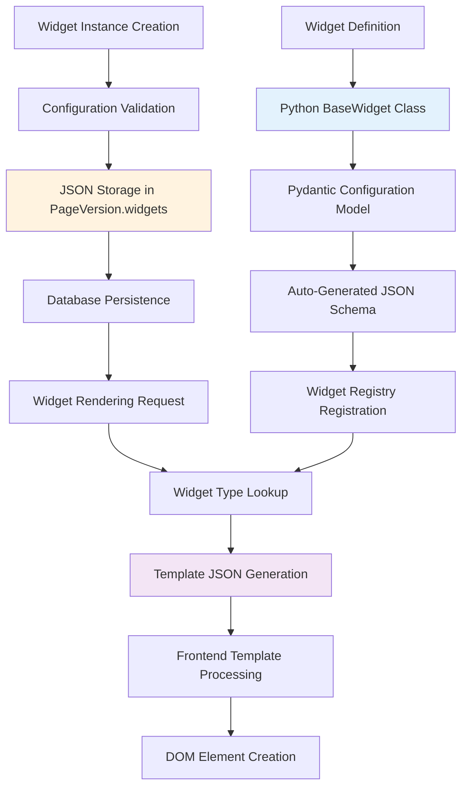

# Widget System Current Architecture - eceee_v4

> **Authoritative Widget System Documentation**  
> **Status**: ✅ Current and Complete  
> **Last Updated**: December 2024  
> **Version**: 2.0 - Reflects actual implementation

## Overview

This document provides the definitive guide to eceee_v4's widget system architecture, including code-based widget definitions, serialization patterns, data flow, and rendering approaches. This documentation reflects the **actual current implementation** rather than idealized architecture.

## Widget System Architecture

### High-Level Widget Flow



## Backend Widget System

### 1. Code-Based Widget Definitions

**Widget Base Class** (`backend/webpages/widget_registry.py`):

```python
from abc import ABC, abstractmethod
from typing import Dict, Any, Optional
from pydantic import BaseModel

class BaseWidget(ABC):
    """Abstract base class for all widget implementations"""
    
    # Required class attributes
    name: str = None
    description: str = ""
    template_name: str = None
    is_active: bool = True
    
    # Pydantic configuration model (must be defined in subclasses)
    configuration_model: type[BaseModel] = None
    
    @property
    def type(self):
        """Unique widget type identifier"""
        module = self.__class__.__module__
        app_label = module.split(".")[0]
        class_name = self.__class__.__name__
        return f"{app_label}.{class_name}"
    
    def to_dict(self, include_template_json: bool = True) -> Dict[str, Any]:
        """Convert widget to API representation"""
        result = {
            "type": self.type,
            "name": self.name,
            "description": self.description,
            "template_name": self.template_name,
            "is_active": self.is_active,
            "configuration_schema": self.configuration_model.model_json_schema(),
        }
        
        # Include template JSON when requested (for serialization)
        if include_template_json:
            template_json = self.get_template_json()
            if template_json:
                result["template_json"] = template_json
                
        return result
    
    def get_template_json(self) -> Optional[Dict[str, Any]]:
        """Generate JSON representation of widget template"""
        try:
            from .utils.template_parser import WidgetSerializer
            serializer = WidgetSerializer()
            result = serializer.serialize_widget_template(self)
            return result["template_json"]
        except Exception as e:
            logger.warning(f"Failed to parse template for widget '{self.name}': {e}")
            return None
```

### 2. Widget Registration System

**Auto-Discovery and Registration**:

```python
# backend/webpages/widget_registry.py
class WidgetTypeRegistry:
    """Global registry for widget type classes"""
    
    def __init__(self):
        self._widget_types: Dict[str, BaseWidget] = {}
        self._widget_classes: Dict[str, type[BaseWidget]] = {}
    
    def register(self, widget_class: type[BaseWidget]) -> None:
        """Register a widget class"""
        if not issubclass(widget_class, BaseWidget):
            raise ImproperlyConfigured(f"Widget class must inherit from BaseWidget")
        
        # Create instance and validate
        instance = widget_class()
        widget_type = instance.type
        
        self._widget_classes[widget_type] = widget_class
        self._widget_types[widget_type] = instance
        
        logger.info(f"Registered widget: {widget_type}")
    
    def get_widget_type(self, type_name: str) -> Optional[BaseWidget]:
        """Get widget instance by type name"""
        return self._widget_types.get(type_name)
    
    def list_widget_types(self, active_only: bool = True) -> List[BaseWidget]:
        """Get all registered widget types"""
        widgets = list(self._widget_types.values())
        if active_only:
            widgets = [w for w in widgets if w.is_active]
        return widgets

# Global registry instance
widget_type_registry = WidgetTypeRegistry()

# Decorator for easy registration
def register_widget(widget_class: type[BaseWidget]) -> type[BaseWidget]:
    widget_type_registry.register(widget_class)
    return widget_class
```

### 3. Example Widget Implementation

**Content Widget** (`backend/core_widgets/widgets.py`):

```python
from pydantic import BaseModel, Field
from ..webpages.widget_registry import BaseWidget, register_widget

class ContentWidgetConfig(BaseModel):
    """Pydantic model for ContentWidget configuration"""
    content: str = Field(default="", description="HTML content")
    format: str = Field(default="html", description="Content format (html/markdown)")
    css_classes: str = Field(default="", description="Additional CSS classes")

@register_widget
class ContentWidget(BaseWidget):
    """Rich text content widget"""
    
    name = "Content Widget"
    description = "Rich text content with HTML and Markdown support"
    template_name = "core_widgets/content_widget.html"
    configuration_model = ContentWidgetConfig
    
    def get_css_for_injection(self, widget_instance=None, scope_id: str = None) -> Dict[str, str]:
        """Return CSS to be injected for this widget"""
        return {
            "widget_content": """
                .content-widget { margin: 1rem 0; }
                .content-widget h1, .content-widget h2 { margin-bottom: 0.5rem; }
            """
        }
```

## Widget Serialization System

### 1. Template JSON Generation

**Widget Template Serializer** (`backend/webpages/utils/template_parser.py`):

```python
class WidgetSerializer:
    """Serialize widget templates to JSON representation"""
    
    def __init__(self):
        self.parser = WidgetTemplateParser()
    
    def serialize_widget_template(self, widget_instance) -> Dict[str, Any]:
        """Convert Django template to JSON structure"""
        try:
            template_name = widget_instance.template_name
            template_json = self.parser.parse_widget_template(template_name)
            
            return {
                "widget": {
                    "name": widget_instance.name,
                    "template_name": template_name,
                },
                "template_json": template_json,
            }
        except Exception as e:
            logger.error(f"Error serializing widget template {widget_instance.name}: {e}")
            raise Exception("Widget template parsing failed")
```

### 2. Widget Storage Format

**Database Storage** (in `PageVersion.widgets` JSONField):

```json
{
  "main": [
    {
      "type": "core_widgets.ContentWidget",
      "config": {
        "content": "<h2>Welcome</h2><p>This is rich text content.</p>",
        "format": "html",
        "css_classes": "featured-content"
      },
      "id": "widget-abc123",
      "sort_order": 0
    },
    {
      "type": "core_widgets.ImageWidget",
      "config": {
        "url": "/media/uploads/hero-image.jpg",
        "alt": "Hero image",
        "caption": "Beautiful landscape",
        "alignment": "center"
      },
      "id": "widget-def456", 
      "sort_order": 1
    }
  ],
  "sidebar": [
    {
      "type": "core_widgets.NavigationWidget",
      "config": {
        "menu_items": [
          {"title": "Home", "url": "/"},
          {"title": "About", "url": "/about/"}
        ],
        "style": "vertical"
      },
      "id": "widget-ghi789",
      "sort_order": 0
    }
  ]
}
```

## Frontend Widget System

### 1. Widget Data Flow

**API to Frontend Pipeline**:

```javascript
// 1. Widget Types API Response
{
  "type": "core_widgets.ContentWidget",
  "name": "Content Widget", 
  "description": "Rich text content widget",
  "configuration_schema": {
    "type": "object",
    "properties": {
      "content": {"type": "string", "description": "HTML content"},
      "format": {"type": "string", "description": "Content format"}
    }
  },
  "template_json": {
    // Serialized template structure for rendering
    "elements": [...],
    "css": [...],
    "javascript": [...]
  },
  "is_active": true
}

// 2. Widget Instance Data (from PageVersion.widgets)
{
  "type": "core_widgets.ContentWidget",
  "config": {
    "content": "<h2>Hello World</h2>",
    "format": "html"
  },
  "id": "widget-123",
  "sort_order": 0
}
```

### 2. Frontend Widget Rendering

**LayoutRenderer.js Template JSON Processing**:

```javascript
// frontend/src/components/LayoutRenderer.js
class LayoutRenderer {
  async renderWidgetContent(type, config, widgetInstance = null) {
    try {
      // Look up widget definition with template JSON
      const availableWidgets = await this.getAvailableWidgets();
      const widgetDef = availableWidgets.find(w => w.type === widgetInstance.type);
      
      if (widgetInstance && 
          widgetDef?._apiData && 
          widgetDef?._apiData?.templateJson) {
        
        // Use template JSON rendering with caching
        return this.renderFromTemplateJsonCached(
          widgetDef._apiData.templateJson,
          config,
          type,
          widgetInstance.id // For CSS scoping
        );
      }
      
      // Fallback to legacy rendering
      return this.renderWidgetContentLegacy(type, config);
      
    } catch (error) {
      console.error('LayoutRenderer: Error in renderWidgetContent', error);
      return this.createErrorWidgetElement(`Widget render error: ${error.message}`);
    }
  }
  
  renderFromTemplateJsonCached(templateJson, config, type, widgetId) {
    // Check cache first
    const cacheKey = `${type}-${JSON.stringify(config)}`;
    if (this.templateCache.has(cacheKey)) {
      this.cacheMetrics.hits++;
      return this.templateCache.get(cacheKey).cloneNode(true);
    }
    
    // Render from template JSON
    const element = this.templateRenderer.render(templateJson, config, widgetId);
    
    // Cache result
    this.templateCache.set(cacheKey, element.cloneNode(true));
    this.cacheMetrics.misses++;
    
    return element;
  }
}
```

### 3. React Widget Integration

**ReactLayoutRenderer.jsx Widget Handling**:

```jsx
// frontend/src/editors/page-editor/ReactLayoutRenderer.jsx
const ReactLayoutRenderer = ({ layoutName, widgets, onWidgetAction, editable }) => {
  const LayoutComponent = getLayoutComponent(layoutName);
  
  return (
    <LayoutComponent
      widgets={widgets}
      onWidgetAction={onWidgetAction}
      editable={editable}
      onShowWidgetModal={(slotName) => {
        // Handle widget addition
        onWidgetAction('add', { slotName });
      }}
      onClearSlot={(slotName) => {
        // Handle slot clearing
        onWidgetAction('clear', { slotName });
      }}
    />
  );
};

// WidgetSlot.jsx - Individual slot management
const WidgetSlot = ({ name, widgets, onWidgetAction, editable, maxWidgets }) => {
  return (
    <div className="widget-slot" data-slot={name}>
      {widgets.map((widget, index) => (
        <div key={widget.id} className="widget-container">
          {editable && (
            <WidgetControls 
              widget={widget}
              onEdit={() => onWidgetAction('edit', { widget })}
              onDelete={() => onWidgetAction('delete', { widget })}
              onMove={(direction) => onWidgetAction('move', { widget, direction })}
            />
          )}
          <WidgetRenderer widget={widget} />
        </div>
      ))}
      
      {editable && (!maxWidgets || widgets.length < maxWidgets) && (
        <button 
          onClick={() => onWidgetAction('add', { slotName: name })}
          className="add-widget-btn"
        >
          Add Widget
        </button>
      )}
    </div>
  );
};
```

## Widget Configuration Validation

### 1. Pydantic Schema Validation

**Backend Validation** (`backend/webpages/serializers.py`):

```python
class WidgetUpdateSerializer(serializers.ModelSerializer):
    """Specialized serializer for widget-only updates"""
    
    def validate_widgets(self, value):
        """Validate widget configurations against Pydantic schemas"""
        if not isinstance(value, dict):
            raise serializers.ValidationError("Widgets must be a dictionary")
        
        converted_widgets = {}
        
        for slot_name, widgets in value.items():
            converted_widgets[slot_name] = []
            
            for i, widget in enumerate(widgets):
                # Validate widget type exists
                widget_type_name = widget.get("type") or widget.get("widget_type")
                widget_type = widget_type_registry.get_widget_type(widget_type_name)
                
                if not widget_type:
                    raise serializers.ValidationError(
                        f"Unknown widget type: {widget_type_name}"
                    )
                
                # Validate configuration against Pydantic model
                try:
                    config = widget.get("config", {})
                    validated_config = widget_type.configuration_model(**config)
                    widget["config"] = validated_config.model_dump()
                except ValidationError as e:
                    raise serializers.ValidationError(
                        f"Invalid configuration for widget {i} in slot '{slot_name}': {e}"
                    )
                
                converted_widgets[slot_name].append(widget)
        
        return converted_widgets
```

### 2. Frontend Configuration Forms

**Dynamic Form Generation**:

```jsx
// frontend/src/components/WidgetConfigurationForm.jsx
const WidgetConfigurationForm = ({ widgetType, initialConfig, onSave }) => {
  const [config, setConfig] = useState(initialConfig || {});
  
  // Generate form fields from JSON schema
  const renderConfigField = (fieldName, fieldSchema) => {
    switch (fieldSchema.type) {
      case 'string':
        if (fieldSchema.format === 'html') {
          return (
            <RichTextEditor
              key={fieldName}
              label={fieldSchema.description}
              value={config[fieldName] || ''}
              onChange={(value) => setConfig({...config, [fieldName]: value})}
            />
          );
        }
        return (
          <TextInput
            key={fieldName}
            label={fieldSchema.description}
            value={config[fieldName] || ''}
            onChange={(value) => setConfig({...config, [fieldName]: value})}
          />
        );
      
      case 'boolean':
        return (
          <Checkbox
            key={fieldName}
            label={fieldSchema.description}
            checked={config[fieldName] || false}
            onChange={(checked) => setConfig({...config, [fieldName]: checked})}
          />
        );
      
      default:
        return <div key={fieldName}>Unsupported field type: {fieldSchema.type}</div>;
    }
  };
  
  return (
    <form onSubmit={(e) => { e.preventDefault(); onSave(config); }}>
      {Object.entries(widgetType.configuration_schema.properties).map(
        ([fieldName, fieldSchema]) => renderConfigField(fieldName, fieldSchema)
      )}
      <button type="submit">Save Configuration</button>
    </form>
  );
};
```

## Performance Optimizations

### 1. Template JSON Caching

**Frontend Caching Strategy**:

```javascript
// frontend/src/components/LayoutRenderer.js
class LayoutRenderer {
  constructor(options = {}) {
    // Template JSON caching for performance
    this.templateCache = new Map();
    this.templatePreprocessCache = new Map();
    this.cacheMetrics = { hits: 0, misses: 0, evictions: 0 };
    this.cacheLocks = new Map(); // Prevent race conditions
  }
  
  async preloadWidgetTemplates(widgets) {
    /**
     * Preload widget templates in the background for performance
     */
    const preloadPromises = widgets.map(async (widget) => {
      if (widget._apiData?.templateJson) {
        const cacheKey = `template-${widget.type}`;
        if (!this.templatePreprocessCache.has(cacheKey)) {
          // Preprocess template structure for faster rendering
          const preprocessed = this.preprocessTemplate(widget._apiData.templateJson);
          this.templatePreprocessCache.set(cacheKey, preprocessed);
        }
      }
    });
    
    await Promise.all(preloadPromises);
  }
  
  preprocessTemplate(templateJson) {
    /**
     * Preprocess template JSON for optimized rendering
     */
    return {
      elements: this.optimizeElementStructure(templateJson.elements),
      css: this.compileCssRules(templateJson.css),
      javascript: this.prepareJavaScript(templateJson.javascript)
    };
  }
}
```

### 2. Widget Data Optimization

**Backend Optimization**:

```python
# backend/webpages/views.py
class WidgetTypeViewSet(viewsets.ReadOnlyModelViewSet):
    """API endpoint for widget type definitions"""
    
    def list(self, request):
        """Optimized widget type listing"""
        # Check if template JSON should be included
        include_template_json = request.query_params.get('include_template_json', 'true').lower() == 'true'
        
        widget_types = widget_type_registry.list_widget_types(active_only=True)
        
        # Serialize with optional template JSON for performance
        serialized_widgets = [
            widget_type.to_dict(include_template_json=include_template_json)
            for widget_type in widget_types
        ]
        
        return Response({
            'results': serialized_widgets,
            'count': len(serialized_widgets),
            'template_json_included': include_template_json
        })
```

## Current System Status

### ✅ What Works Well

#### **Code-Based Architecture**
- **Auto-Discovery**: Widgets automatically registered from Django apps
- **Type Safety**: Pydantic models provide configuration validation
- **Flexibility**: Easy to add new widget types without database changes
- **Performance**: Template JSON caching optimizes rendering

#### **Serialization Benefits**
- **Consistency**: Standardized widget data format across system
- **Caching**: Template JSON enables performance optimizations
- **Portability**: Widget configurations can be exported/imported
- **Validation**: Pydantic ensures data integrity

#### **Dual Rendering Support**
- **Public Pages**: Django template rendering for SEO and performance
- **Interactive Editing**: React components for rich editing experience
- **Preview Mode**: Vanilla JS rendering for fast previews

### ⚠️ Current Challenges

#### **Complexity Management**
- **Multiple Rendering Paths**: Django templates, template JSON, React components
- **Synchronization**: Widget definitions must be consistent across systems
- **Debugging**: Template JSON errors can be difficult to trace

#### **Performance Considerations**
- **Serialization Overhead**: Template JSON generation adds processing time
- **Cache Management**: Template cache requires memory management
- **Network Payload**: Template JSON increases API response size

### 🎯 Best Practices for Widget Development

#### **Widget Creation Checklist**
1. **Define Pydantic Model**: Create configuration model with validation
2. **Implement BaseWidget**: Inherit from BaseWidget with required attributes
3. **Create Django Template**: Design template for server-side rendering
4. **Register Widget**: Use `@register_widget` decorator
5. **Test Configuration**: Validate Pydantic model with various inputs
6. **Test Rendering**: Verify template JSON generation and frontend rendering
7. **Document Usage**: Provide examples and configuration documentation

#### **Performance Guidelines**
- **Minimize Template Complexity**: Keep Django templates simple for faster parsing
- **Optimize Configuration**: Use efficient Pydantic field types
- **Cache Considerations**: Design widgets with caching in mind
- **Error Handling**: Provide meaningful error messages for configuration issues

## Future Evolution

### Short-term Improvements
1. **Enhanced Caching**: Improve template JSON cache invalidation
2. **Better Debugging**: Add development tools for template JSON inspection
3. **Performance Metrics**: Add monitoring for widget rendering performance
4. **Configuration UI**: Improve widget configuration form generation

### Long-term Considerations
1. **React-First Widgets**: Explore pure React component widgets
2. **Server Components**: Investigate React Server Components for SSR
3. **WebAssembly**: Consider WASM for performance-critical widget rendering
4. **GraphQL Integration**: Explore GraphQL for widget data fetching

---

**Widget System Status**: Production-ready with comprehensive serialization  
**Architecture**: Code-based with Pydantic validation and template JSON rendering  
**Performance**: Optimized with caching and preprocessing  
**Last Updated**: December 2024
