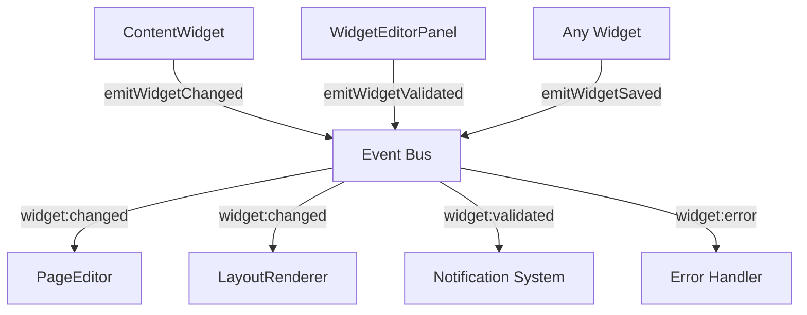

# Widget Event System Documentation

## Overview

The Widget Event System is a centralized, event-driven architecture that eliminates prop drilling and simplifies widget communication throughout the page editor. Instead of passing callbacks through multiple component layers, widgets can emit events that any component can listen to.

## Problem Solved

**Before:** Complex prop drilling chain
```
ContentWidget → WidgetEditorPanel → PageEditor → ContentEditor → LayoutRenderer
```

**After:** Direct event communication
```
ContentWidget → emits event → PageEditor (listens directly)
                            → LayoutRenderer (listens directly)
                            → Any other component (listens directly)
```

## Architecture

### Core Components

1. **WidgetEventContext** - Centralized event bus
2. **Widget Event Types** - Type-safe event definitions  
3. **Event Emitters** - Convenience hooks for emitting events
4. **Event Listeners** - Hooks for subscribing to events

### Event Flow



## Event Types

### Primary Events

- `widget:changed` - Real-time config changes (for live preview)
- `widget:saved` - Persistent changes (saved to backend)
- `widget:validated` - Validation results
- `widget:error` - Error notifications

### CRUD Events

- `widget:added` - Widget added to slot
- `widget:removed` - Widget removed from slot
- `widget:moved` - Widget reordered

### Editor Events

- `widget:editor:opened` - Widget editor opened
- `widget:editor:closed` - Widget editor closed

## Usage

### Emitting Events

```jsx
import { useWidgetEventEmitter } from '../contexts/WidgetEventContext'
import { WIDGET_CHANGE_TYPES } from '../types/widgetEvents'

const MyWidget = ({ widgetId, slotName, config }) => {
  const { emitWidgetChanged } = useWidgetEventEmitter()
  
  const handleChange = (newConfig) => {
    // Emit event - no prop drilling needed!
    emitWidgetChanged(
      widgetId, 
      slotName, 
      { id: widgetId, config: newConfig }, 
      WIDGET_CHANGE_TYPES.CONFIG
    )
  }
  
  return <div>...</div>
}
```

### Listening to Events

```jsx
import { useWidgetEventListener } from '../contexts/WidgetEventContext'
import { WIDGET_EVENTS } from '../types/widgetEvents'

const PageEditor = () => {
  // Listen to widget changes - no prop drilling needed!
  useWidgetEventListener(WIDGET_EVENTS.CHANGED, (payload) => {
    // Update layout renderer
    updateWidgetInRenderer(payload.slotName, payload.widget)
  }, [])
  
  useWidgetEventListener(WIDGET_EVENTS.VALIDATED, (payload) => {
    if (!payload.isValid) {
      showValidationErrors(payload.errors)
    }
  }, [])
  
  return <div>...</div>
}
```

### Event Payload Structure

```typescript
// widget:changed event
{
  widgetId: string,
  slotName: string,
  widget: WidgetInstance,
  changeType: 'config' | 'position' | 'slot' | 'metadata',
  timestamp: number
}

// widget:validated event
{
  widgetId: string,
  slotName: string,
  isValid: boolean,
  errors: Record<string, string[]>,
  warnings: Record<string, string[]>,
  timestamp: number
}
```

## Benefits

### 1. **No Prop Drilling**
- Components communicate directly through events
- No need to pass callbacks through multiple layers
- Cleaner component interfaces

### 2. **Easy Debugging**
- All events logged in development mode
- Single place to monitor widget communication
- Clear event payloads with timestamps

### 3. **Flexible Architecture**
- Any component can listen to any event
- Easy to add new event types
- Decoupled components

### 4. **Type Safety**
- Event types defined in `types/widgetEvents.js`
- Payload validation in development
- Clear event contracts

### 5. **Performance**
- Events are asynchronous (non-blocking)
- Automatic cleanup of event listeners
- Debounced updates prevent excessive calls

## Debugging

### Development Mode Features

```javascript
// Enable debug logging
process.env.NODE_ENV === 'development'

// Console output examples:
// 🔔 Widget Event: widget:changed { widgetId: 'abc123', slotName: 'main', ... }
// 📡 Subscribed to widget event: widget:changed (2 total listeners)
// 📡 Unsubscribed from widget event: widget:changed (1 remaining listeners)
```

### Event Inspector

```jsx
import { useWidgetEvents } from '../contexts/WidgetEventContext'

const DebugPanel = () => {
  const { getListenerCount } = useWidgetEvents()
  
  return (
    <div>
      <p>widget:changed listeners: {getListenerCount('widget:changed')}</p>
      <p>widget:validated listeners: {getListenerCount('widget:validated')}</p>
    </div>
  )
}
```

## Migration Guide

### From Prop Drilling to Events

**Old Pattern:**
```jsx
// Multiple callback props
<ContentWidget 
  onConfigChange={handleConfigChange}
  onValidationChange={handleValidation}
  onError={handleError}
/>
```

**New Pattern:**
```jsx
// Just pass widget identity
<ContentWidget 
  widgetId={widget.id}
  slotName={slotName}
  config={widget.config}
/>
```

### Backward Compatibility

The system maintains backward compatibility:
- Existing `onConfigChange` callbacks still work
- Events are emitted in addition to callbacks
- Gradual migration is possible

## Best Practices

### 1. **Event Naming**
- Use consistent prefixes: `widget:`, `slot:`, `editor:`
- Be specific: `widget:config:changed` vs `widget:changed`
- Include context in payload

### 2. **Error Handling**
```jsx
const { emitWidgetError } = useWidgetEventEmitter()

try {
  // widget operation
} catch (error) {
  emitWidgetError(widgetId, slotName, error, 'config-update')
}
```

### 3. **Performance**
```jsx
// Debounce frequent events
const debouncedEmit = useMemo(() => 
  debounce((data) => emitWidgetChanged(...data), 300), 
  [emitWidgetChanged]
)
```

### 4. **Type Safety**
```jsx
import { createWidgetChangedPayload } from '../types/widgetEvents'

// Use payload creators for type safety
const payload = createWidgetChangedPayload(widgetId, slotName, widget, 'config')
emit('widget:changed', payload)
```

## Testing

### Unit Tests

```jsx
import { renderHook } from '@testing-library/react'
import { WidgetEventProvider, useWidgetEvents } from '../contexts/WidgetEventContext'

test('should emit and receive events', () => {
  const wrapper = ({ children }) => (
    <WidgetEventProvider>{children}</WidgetEventProvider>
  )
  
  const { result } = renderHook(() => useWidgetEvents(), { wrapper })
  
  let receivedPayload = null
  const unsubscribe = result.current.subscribe('test:event', (payload) => {
    receivedPayload = payload
  })
  
  result.current.emit('test:event', { test: 'data' })
  
  expect(receivedPayload).toEqual({ test: 'data' })
  unsubscribe()
})
```

### Integration Tests

```jsx
import { render, fireEvent } from '@testing-library/react'
import { WidgetEventProvider } from '../contexts/WidgetEventContext'
import ContentWidget from '../components/widgets/ContentWidget'

test('should emit widget changed event on content update', () => {
  const events = []
  
  render(
    <WidgetEventProvider>
      <TestListener onEvent={(type, payload) => events.push({ type, payload })} />
      <ContentWidget widgetId="test-123" slotName="main" config={{ content: 'test' }} />
    </WidgetEventProvider>
  )
  
  // Simulate content change
  const editor = screen.getByRole('textbox')
  fireEvent.input(editor, { target: { innerHTML: 'new content' } })
  
  expect(events).toHaveLength(1)
  expect(events[0].type).toBe('widget:changed')
  expect(events[0].payload.widgetId).toBe('test-123')
})
```

## Future Enhancements

### 1. **Event Persistence**
- Save events to localStorage for debugging
- Event replay functionality
- Time-travel debugging

### 2. **Event Metrics**
- Performance monitoring
- Event frequency analysis
- Memory leak detection

### 3. **Advanced Features**
- Event middleware
- Conditional event propagation  
- Event transformation pipelines

## Conclusion

The Widget Event System eliminates prop drilling while providing a robust, type-safe, and debuggable communication layer for widget interactions. It maintains backward compatibility while offering significant improvements in code maintainability and developer experience.
